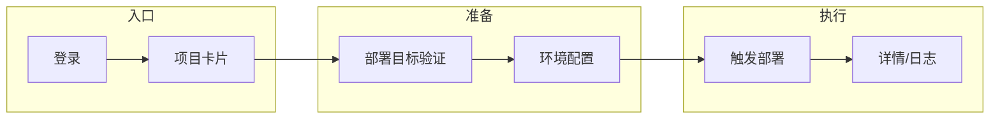

# Launchly UI 与交互规范

> **版本**：2.2  
> **生效日期**：2026-05-18  
> **地位**：所有页面结构、交互、视觉规范的单一来源；**不**重复产品决策条文（见 [产品设计规范](./产品设计规范.md)）。  
> **静态原型**：`docs/prototypes/Launchly-prototype.html`（壳层）、`docs/prototypes/Launchly-prototype.html`（环境目录表）。  
> **历史**：v1 全文见 [docs/archive/v1-2026-05/root/UI设计与规范.md](../archive/v1-2026-05/root/UI设计与规范.md)。

---

## 1. 设计原则（摘要）

1. **部署工具气质**：首屏与主导航服务「**此刻流水线在干什么**」，而非资源台账；允许在次级视图使用 **高密度表格**（环境目录、审计等）。
2. **严肃克制**：中性背景 + **单一主色**（teal，与 `docs/prototypes/Launchly-prototype.html` 对齐，见 §3）；状态色专用于语义（成功/警告/失败）。
3. **白灰斑马（工作空间环境表）**：项目整块 **#FFFFFF / #f5f5f5** 交替；类型标签 **灰底+细边框**，禁用大块彩色行背景做项目区分。
4. **可访问**：状态 = 颜色 + 文字 +（可选）图标。
5. **零情绪化**：禁用 confetti、过度庆祝 toast；失败用 **安静错误条 + 明确下一步**。

---

## 2. 信息架构（目标壳层）

- **顶栏**：Logo、**圆角全局搜索**、主按钮「触发部署」「连接仓库」、用户区；整体为白底 sticky 顶栏，内容居中约束在 1200px 左右。  
- **第二行**：**横向药丸导航** — 概览 / 部署与运行 / 项目 / 发布 / 测试与 Issue / 部署目标 / **更多**。  
- **配置二级化**：成员、审计、通知、系统设置、环境变量、项目配置等不占主导航常驻坑位；放入「更多」、项目详情二级页、设置页或上下文入口。
- **概览默认状态**：默认展示「正在发生什么」：进行中的构建/部署、最近成功或失败、下一步待处理项；**不**以空表格、统计卡堆叠或传统管理后台 dashboard 作为首屏。
- **禁止**：左侧 **256px 灰侧栏作为唯一主导航中心**；当前 `AppLayout.vue` 若仍为侧栏，只能视为过渡实现，最终以 `docs/prototypes/Launchly-prototype.html` 的壳层为准。

### 2.1 壳层验收口径

| 区域 | 必须满足 | 不接受 |
| --- | --- | --- |
| 品牌区 | `Launch` 深色 + `ly` teal；可在文字前使用透明背景图标 | 只在浏览器 tab 有图标，页面内无品牌识别 |
| 全局搜索 | 顶栏内圆角搜索框，placeholder 类似「搜索部署、项目、分支…」 | 放在页面内容区，或只做普通小输入框 |
| 主行动 | 「触发部署」为 teal pill 主按钮；「连接仓库」为次级 pill | 多个同权重主按钮挤满顶栏 |
| 工作域导航 | 横向 pill，激活态为浅 teal 背景 | 左侧资源树承担主导航 |
| 概览内容 | 左侧运行中/最近列表，右侧下一步待办 | 一屏全是统计数字、空表入口或设置项 |
| 配置入口 | 从项目卡、详情、更多、设置进入 | 环境变量、成员、审计等全部挤进主导航 |

---

## 3. 通用设计系统

### 3.1 色与字

| Token / 用途 | 值 | 说明 |
| --- | --- | --- |
| `colorPrimary` | `#0D9488` | 主按钮、激活导航、关键强调 |
| `colorPrimarySoft` | `#CCFBF1` | 激活导航、弱强调背景 |
| 页面背景（亮） | `#F8F9FB` | 与原型壳层一致 |
| 卡片背景 | `#FFFFFF` | |
| 边框 / 分割线 | `#E5E7EB` | 卡片、顶栏、列表分割 |
| 正文 | `#111827` 附近 | |
| 次要文字 | `#6B7280` | |
| success / warning / danger | `#059669` / `#D97706` / `#DC2626` | 仅语义，不替代主色 |

字体：系统无衬线栈（`-apple-system`, `Segoe UI`, `PingFang SC`, sans-serif）；**正文 14px** 为基准。

### 3.2 圆角、间距与按钮

| 元素 | 规范 |
| --- | --- |
| 卡片圆角 | **12px**（与壳层原型一致） |
| 小控件 / 输入框 | **6～8px**；顶栏搜索为 pill |
| 主行动（顶栏） | 允许 **全圆角 pill**（与原型一致） |
| 页面内边距 | **24px** |
| 卡片内边距 | **16～20px** |
| 表格行高 | 舒适可读，表头背景 `#F6F8FA` |

按钮：**Primary** 用于主路径（部署、保存关键表单）；**Default/Ghost** 用于次要；**Danger** 仅破坏性操作；禁用必须 **可解释原因**（tooltip 或行内文案）。

### 3.3 表格与列表

- **工作空间环境目录**：见 [§4.3](#43-environments)；合并列 + 按项目分页。  
- **纯展示型大表**：斑马行可用 **极浅 neutral**；与「项目块白灰斑马」区分用途。

### 3.4 状态与反馈

- **Loading**：页面级 skeleton 或 spin；按钮内 loading。  
- **Empty**：标题 + 一句说明 + **主行动**（去创建 / 去连接）。  
- **Error**：三句式（现象 → 建议 → 可展开详情），与产品 Zero-Config 错误模型一致。

---

## 4A. 原型与「非后台」定位

开发 UI 前先对照静态 HTML（**气质与 IA 以原型为准**，当前 Vue 侧栏布局仅为过渡）：

| 原型 | 路径 | 用途 |
| --- | --- | --- |
| 全站壳层 | [Launchly-prototype.html](../prototypes/Launchly-prototype.html) | 顶栏、圆角全局搜索、teal 主按钮、药丸导航、运行态卡片、配置二级化 — **避免做成传统左侧主导航控制台** |
| 环境目录表 | [Launchly-prototype.html](../prototypes/Launchly-prototype.html) | 合并列、项目块白/灰斑马、分页语义 |

---

## 4B. 组织角色与页面权限（实现必须对齐 API）

权限条文以 [产品设计规范 §3.3](./产品设计规范.md) 为准。本节补充 **「到哪一页、点什麽、看到什麽」**，便于开发与验收。

### 4B.1 角色简述

| 角色 | 典型能力 |
| --- | --- |
| **Owner** | Workspace 配置、成员审批、敏感配置、部署与发布（除非另有限制） |
| **Member** | 参与项目；默认预期：**可读**项目详情与环境；**写操作**（改仓库绑定、部署目标私钥、触发部署）是否开放由后端策略统一裁决 — UI 必须与 403/禁用态一致 |
| **Viewer** | **只读**：可看列表与详情摘要，**不得**出现可用的保存 / 删除 / 部署 / 回滚按钮 |
| **非成员**（未加入项目） | **不得**打开项目详情与任何带 `projectId` 的敏感 API；前端展示 **403 / 无权限** 页，且文案**不泄露**该项目是否存在（口径由安全评审最终确定时可微调） |

### 4B.2 关键页面：入口、点击结果与控件可见性

以下为 **目标行为**；「实现状态」仍以 §4.3 汇总表为准。

#### 概览 `/`

| 动作 | Owner | Member | Viewer |
| --- | --- | --- | --- |
| 进入页面 | 见进行中部署、最近失败、待处理 Issue（若有） | 同上，数据范围随权限过滤 | 只读卡片与链接 |
| 点击某条部署 | 进 `/deployments/:id` | 若无权访问该部署则 403 | 只读则同上 |

#### 项目列表 `/projects`

| 动作 | Owner | Member | Viewer |
| --- | --- | --- | --- |
| 进入 | 卡片（或列表）展示 **当前用户有权限的项目** | 同上 | 同上，仅只读 |
| 点击「新建项目」 | 可用 | 若策略允许 | Viewer：**隐藏或禁用** |
| 点击项目卡片 / 名称 | 进入 `/projects/:id` | 进入详情（仅成员） | 进入详情只读 |
| 非成员误闯 `/projects/:id` | — | — | **403** |

#### 项目详情 `/projects/:id`

| 区域 / 动作 | Owner | Member | Viewer |
| --- | --- | --- | --- |
| 仓库 URL / 分支展示 | 可见 | 可见 | 可见 |
| 编辑仓库或命令 | 表单可用 | 按策略（默认倾向 Owner） | **全部只读** |
| 「部署」主按钮 | 可用 | 若策略允许部署则可用 | **隐藏** |
| 「部署目标」链接 | 进入子页 | 进入（敏感字段脱敏） | 只读或受限 |
| Component 折叠（多组件时） | 展开编辑 | 依策略 | 只读 |

#### 部署目标 `/projects/:id/deploy-targets`

| 动作 | Owner | Member | Viewer |
| --- | --- | --- | --- |
| 列表 | 主机指纹等 **脱敏** 展示 | 同左 | 仅查看或不可见敏感列 |
| 添加 / 编辑 / 删除 | Owner 默认可用 | **默认禁用写**，除非产品另行放开 | 禁用 |
| 「验证连接」 | Owner ✓ | Member 若允许写则可点 | Viewer 不可点 |

#### 部署列表 `/deployments` 与详情 `/deployments/:id`

| 动作 | Owner | Member | Viewer |
| --- | --- | --- | --- |
| 列表筛选 | ✓ | ✓（数据范围受限） | 只读 |
| 详情日志流 | ✓ | ✓（若能访问该 deployment） | 只读 |
| 重试 / 回滚 | Owner ✓ | 依策略 | Viewer **不可见** |

#### 工作空间环境目录 `/environments`

| 动作 | Owner | Member | Viewer |
| --- | --- | --- | --- |
| 查看合并项目块 | ✓ | ✓ | ✓ |
| 编辑环境变量 | Owner ✓ | 依策略 | ✗ |

#### 成员 `/members`、设置 `/settings`

- **邀请**：Member 可发起，**Owner 审批**（见产品文档）。
- **Viewer**：成员页建议仅展示名单，无邀请按钮；设置页仅只读或隐藏敏感项。

---

## 4. 页面清单与交互说明

> **路径**以 hash 路由为准（`#/` 前缀省略）。**目标**列描述设计意图；**交互**列描述关键操作；**实现状态**为截至文档编写时的事实，迁移后以本手册为准。

### 4.1 认证与初始化

| 页面 | 路径 | 目标 | 关键交互 | 实现状态 |
| --- | --- | --- | --- | --- |
| 登录 | `/login` | 进入工作空间 | 邮箱密码、错误提示、Cloud 注册链（若有） | 有 |
| 初始化 | `/init` | Self-Host 首次向导 | 管理员账号与基础配置 | 有 |

### 4.2 壳层内主路由（目标 IA 映射）

| 页面 | 路径 | 目标 | 关键交互 | 实现状态 |
| --- | --- | --- | --- | --- |
| 概览 | `/` | **运行态**：进行中部署、最近记录、下一步待办 | 点击进入某条部署详情；点击待办进入对应任务 | 目标已定：需按 `Launchly-prototype.html` 重构 |
| 项目列表 | `/projects` | 卡片或列表 + **最近部署** | 新建项目、进入详情 | 有列表，需卡片化 |
| 项目创建 | `/projects/create` | 少字段 + 推断 | 仓库 URL、检测、高级折叠 | 有 |
| 项目详情 | `/projects/:id` | 仓库摘要、环境卡片、**部署**入口 | 打开部署 modal、跳转部署目标 | 有 |
| 部署目标 | `/projects/:id/deploy-targets` | BYOS 管理 | 添加、验证、编辑、删除 | 有；需补「返回项目」面包屑 |
| 部署列表 | `/deployments` | 工作空间级历史 | 筛选、进详情 | 有 |
| 部署详情 | `/deployments/:id` | 阶段 + 日志 + **重试** | 展开日志、创建测试任务（成功态） | 部分：重试待加强 |
| 环境（工作空间） | `/environments` | 跨项目环境目录 | 见 §4.3 | 有表；需对齐合并列与分页 |
| 测试用例 | `/tests` | 用例库 | CRUD、关联项目 | 有 |
| 测试任务 | `/tests/runs` | 执行列表 | 进详情 | 有 |
| 测试任务详情 | `/tests/runs/:id` | 结果与日志 | — | 有 |
| Issue 列表 | `/issues` | 协作 | 筛选、进详情 | 有 |
| Issue 详情 | `/issues/:projectId/:id` | 指派与状态 | — | 有 |
| Release 列表 | `/releases` | 发布记录 | 进详情 | 有 |
| Release 详情 | `/releases/:projectId/:id` | 门禁步骤 | — | 有 |
| 审计 | `/audit-logs` | 合规只读，属于更多/设置内二级入口 | 筛选、导出（若有） | 有；入口需二级化 |
| 通知 | `/notifications` | 站内通知，属于用户区或更多入口 | 已读标记 | 有；入口需二级化 |
| 成员 | `/members` | 组织成员与邀请，属于更多/设置内二级入口 | 列表、邀请、审批（目标） | **占位**；入口需二级化 |
| 设置 | `/settings` | Workspace 级设置，属于更多入口 | 表单 | 简版；入口需二级化 |

### 4.3 `Environments`（工作空间级环境目录）

- **布局**：表格；首列 **所属项目** `rowspan` = 该项目环境行数。  
- **列**：项目（合并）、环境名、类型、数据策略、URL、绑定部署目标。  
- **交互**：顶部搜索项目名；**每页项目数** 分页；行内「编辑环境」进 modal（变量在子操作）。  
- **视觉**：项目块 **白 / #f5f5f5** 交替；类型 **中性 tag**。

### 4.4 部署 Modal（项目详情内）

- **必选**：目标环境、**部署目标**、分支。  
- **校验**：未选目标时明确错误文案（指向「部署目标」页）。

---

## 5. 用户关键路径（文字流）

1. **首次成功部署**：登录 → 连接/创建项目 → 添加部署目标并 **验证** → 选择测试环境 → 触发部署 → 详情页看阶段直至成功。  
2. **失败恢复**：部署详情见失败阶段 → 读摘要与日志 → **重试** 或修正配置后再部署。  
3. **发布上线**：测试通过后 → Release / 门禁步骤 → 生产部署（权限受控）。

---

## 6. 与 Ant Design Vue 的关系

- **基础组件**以 AntDV 为主，**token 定制**见归档 UI 规范 §2.3 代码块（迁移至代码内 `ConfigProvider` 为准）。  
- **壳层布局**可自定义顶栏/药丸导航，**不**强制使用 `Layout.Sider` 作为信息架构中心。

---

## 7. 修订记录

| 版本 | 日期 | 说明 |
| --- | --- | --- |
| 2.2 | 2026-05-18 | 对齐 `Launchly-prototype.html`：teal 主色、顶栏+横向工作域、概览运行态、配置二级化验收口径 |
| 2.1 | 2026-05-13 | 增补 §4A/§4B：原型索引、页面权限与点击行为详述 |
| 2.0 | 2026-05-13 | 首版 2.0 |

---

**维护规则**：新增/变更页面 → 更新 **§4 清单表**、**§4A/§4B** 相应小节，并同步原型 HTML；视觉 token → 更新 **§3** 与代码 theme。
