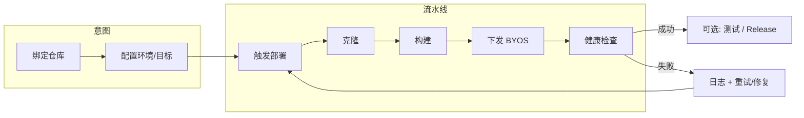

# Launchly 产品设计规范

> **版本**：2.0  
> **生效日期**：2026-05-13  
> **地位**：产品侧唯一权威；与 [技术架构规范](./技术架构规范.md)、[UI 与交互规范](./UI与交互规范.md)、`planning.md`（本地协作，未随仓库上传）配套。  
> **冲突处理**：实现以本文 + 技术/UI 手册为准；**变更须先改文档再改代码**。  
> **历史**：v1 材料见 `docs/archive/v1-2026-05/`（本地归档，未随仓库上传）。

---

## 1. 文档范围与读者

| 读者 | 用途 |
| --- | --- |
| 负责人 / 产品 | 拍板范围、验收、阶段目标 |
| 开发 / AI | 理解「做什么、不做什么」、权限与流程边界 |
| 测试 | 从第 7 节与 UI 手册推导用例与预期 |

本文**不**展开视觉 token、组件圆角、API 字段——分别见 UI 手册与技术手册，避免重复。

---

## 2. 一句话定位与交付形态

**Launchly** 面向 **5～20 人小团队及个人开发者**的 **轻量代码自动部署平台**，**双模式同源**交付：

| 形态 | 说明 |
| --- | --- |
| **Launchly Cloud** | 官方 SaaS，注册（或邀请）使用 |
| **Launchly Self-Host** | 开源 AGPL-3.0，CLI + Compose 自托管 |

**核心闭环**：接入外部 Git 仓库 → 构建 → 部署到 **BYOS（用户自带机）** → 健康检查 → 失败可回滚 / 重试。  
**基础内建（非主线卖点）**：L0/L1 测试、Issue、Release 门禁、审计、通知——与部署链路衔接，但 **信息架构上** 不抢占「运行态」首屏（见第 6 节）。

**商业与目标**：覆盖成本 + 拉 star + 自用友好；不追求融资型增长。

---

## 3. 概念模型

### 3.1 层级

```text
实例（Cloud 多租户 / Self-Host 单实例或多组织远期）
  └── Organization（组织，当前实现常称 Workspace）
        ├── Members（Owner / Member / Viewer）
        ├── Projects
        │     ├── Components（发布单元，单组件时 UI 折叠）
        │     ├── Environments（逻辑阶段：端口、URL、变量、数据策略）
        │     ├── Deployments（运行记录）
        │     └── …测试 / Issue / Release 等
        └── Deploy Targets（BYOS：SSH 等，可被多项目/多环境引用）
```

### 3.2 环境与部署目标（分拆，不可混为一谈）

| 概念 | 回答的问题 | 典型内容 |
| --- | --- | --- |
| **环境** | 哪一阶段、何种数据、访问入口 | TEST / STAGING / PRODUCTION；URL；`isolated|sanitized|real` |
| **部署目标** | 代码与镜像落到 **哪台机器** | 主机、SSH、凭据、验证状态 |

同一物理机可承载多环境（不同端口/目录/compose 工程名）；同一环境换机时改绑定即可，无需改「阶段」定义。

### 3.3 角色与权限（设计口径）

- **Owner / Member / Viewer** 三档组织级角色（不按岗位细分）。
- **项目级权限（设计目标）**：组织成员可 **见项目列表**；**非项目成员** 不得查看项目详情、不得操作部署/发布/敏感配置；**所有带 `projectId` 的 API 必须鉴权**，禁止仅靠前端路由隐藏。
- **邀请**：Member 可 **发起** 组织邀请，**Owner 审批** 后生效（实现排期见 `docs/work/planning.md` 本地协作计划与归档任务包）。

### 3.4 Self-Host vs Cloud（账号）

| 维度 | Self-Host | Cloud |
| --- | --- | --- |
| 注册 | 默认关闭；Owner/CLI 初始化 | 开放注册（产品细化中） |
| 建组织 | 默认不自助泛滥 | 可支持个人空间 + 多组织（细化中） |

---

## 4. 省心体验与 Zero-Config（原则摘要）

**第一原则**：用户为效率而来，默认路径不增加可避免认知负担与步数。

**三层模型**：意图层（名称、仓库、分支可藏、环境/目标）→ 自动化层（推断、降级、可观测）→ 逃逸层（高级：自定义 Dockerfile/命令）。

**默认承诺（可对外说清）**：典型 **Node** 公开仓库、`package.json` 在根；推断失败则保守 npm 默认 + **一条**可执行下一步说明。

**全站信息架构**：默认首屏为 **运行态**（进行中部署、阶段、失败、下一步）；**顶栏 + 横向工作域**，不把长侧栏资源树当作唯一导航中心。配置项收在二级入口，不占主导航。静态参考：`docs/prototypes/Launchly-prototype.html`。

**工作空间级环境目录**：表格 + 项目列 rowspan + **白/浅灰** 项目块斑马 + **按项目分页**；`docs/prototypes/Launchly-prototype.html`。

完整原则条文、检查表与 KPI 原文已归档在 `docs/archive/v1-2026-05/product/zero-config-ux-principles.md`；**执行与验收以原则精神 + 本文第 6 节为准**。

---

## 5. 核心决策（摘录，不可随意推翻）

与归档 `docs/archive/v1-2026-05/root/项目重塑计划.md` §5（本地归档，未随仓库上传）对齐，仅列高频引用：

| ID | 决策 |
| --- | --- |
| D-04 | MVP **仅 BYOS**，不做 Launchly 托管运行时 |
| D-05 | **不做** Git 托管；PAT 拉外部仓库 |
| D-06 | **手动** 触发部署，不监听 webhook |
| D-07 | 角色 **Owner / Member / Viewer** |
| D-08 | **Component** 模型存在，单组件 UI 折叠 |
| D-11 | 测试 **L0 + L1** 为 MVP 档位 |
| D-13 | **默认不要求手写 Dockerfile**；典型 Node 推断；高级自定义（与归档 D-10「不做自动识别」并存时，**以 Zero-Config 与本文 4 节为执行口径**） |
| D-14 | License **AGPL-3.0** |
| D-15 | 单仓库 + `cloud-only/` / `selfhost-only/` + `EDITION` 开关 |

---

## 6. 信息架构与页面职责（目标态）

与归档 PRD §5 及原型一致：

- **概览**：运行中部署、阶段条、最近成功/失败、下一步待办。
- **部署与运行**：记录列表（卡片/时间线优先于纯表）、详情、日志、**重试**。
- **项目**：卡片 + 最近部署；详情内二级：环境、变量、历史等。
- **发布**：Release + 门禁步骤化展示。
- **测试与 Issue**：与部署/分支/项目关联入口聚合。
- **部署目标**：BYOS 列表与验证。
- **更多 / 设置**：成员、审计、通知、组织设置等。

主导航只承载高频工作域：概览、部署与运行、项目、发布、测试与 Issue、部署目标、更多。成员、审计、通知、系统设置、环境变量等配置/协作项，必须从「更多」、用户区、项目详情二级页或上下文入口进入，避免回到旧版后台侧栏。

---

## 7. 功能边界（三档简表）

详细行列见归档 `docs/archive/v1-2026-05/root/项目重塑计划.md` §4（本地归档，未随仓库上传）。此处仅记结构：

- **核心引擎**：项目、仓库绑定、Component、BYOS 部署、构建/健康/日志、手动触发、回滚相关能力。
- **环境与门禁**：多环境、顺序门禁；进阶门禁 Pro。
- **测试**：L0/L1；L2 远期。
- **协作**：Issue、Release 基础。
- **SaaS / Self-Host 差异**：注册、计费、CLI、备份等按形态开关。

---

## 8. 核心业务流程（产品视角）



---

## 9. 非目标与风险（提醒）

- 不做代码托管、不做复杂 CI 编排、不做企业 ITSM。
- 托管运行时、L2 Playwright、深度项目级 RBAC 等为 **远期 / Pro**。
- 文档与实现漂移时，**以文档为纠偏源**。

---

## 10. 修订记录

| 版本 | 日期 | 说明 |
| --- | --- | --- |
| 2.0 | 2026-05-13 | 首版 2.0：合并重塑计划、PRD、Zero-Config、pivot、壳层与权限讨论 |

---

**下一手维护**：任何产品范围、权限、IA、默认路径变更 → **先改本节或 UI / `docs/work/planning.md`（本地协作计划）→ 再改代码**。
