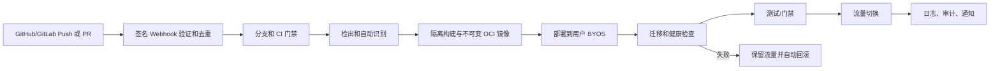

# Launchly 产品设计规范

> **版本**：3.0
> **生效日期**：2026-07-22
> **地位**：产品与范围的唯一权威。技术实现以[技术架构规范](./技术架构规范.md)为准；交付是否成立以[交付验收规范](./交付验收规范.md)的真实 E2E 证据为准。
> **状态用语**：本文的“必须”描述目标能力，**不表示当前代码已经实现**；未通过验收规范的能力不得在 UI、README 或版本说明中标为“已完成”。

## 1. 定位、用户与非目标

**Launchly = 中文优先、轻量 BYOS 全自动应用运行平台 + 小团队发布治理平台。** 面向个人开发者和 5–20 人团队，把外部 Git 仓库的变更可靠地运行在用户自己的服务器上，并把测试、Issue、复测、Release 门禁和审计纳入同一发布闭环。

交付形态：

| 形态 | 控制面 | 应用运行位置 | 当前产品状态 |
| --- | --- | --- | --- |
| Launchly Self-Host | 用户自己的服务器 | 用户自己的服务器 | P1 目标；不得将当前 Compose 骨架表述为已验收 |
| Launchly Cloud | 官方托管 | 用户连接的 BYOS 节点 | P6 目标；多租户、注册、邀请、配额均**未实现** |

Launchly 不做 Git 托管、不把 Kubernetes 作为默认路径、不提供复杂企业 CI DSL，也不提供默认由 Launchly 托管的应用运行时。它面向长期运行的 API、Web、Worker、数据库和容器应用，不采用函数优先模型。

### 1.1 差异化原则

| 原则 | 产品约束 |
| --- | --- |
| 中文优先 | 默认中文信息架构、字段、错误、日志摘要、安装与故障指引；术语可保留 Git、OCI、Webhook 等行业名词，但必须给出中文解释。国际化是扩展能力，不得以英文优先牺牲中文可用性。 |
| 小机可用 | 控制面不依赖 Kubernetes、ELK、Prometheus/Grafana 或一组常驻微服务才能完成首个部署。按需构建、按需测试；空闲时只保留完成闭环所需的 API、Worker、PostgreSQL 与共享代理。 |
| 一条链路做深 | 不以“能启动容器”作为完成。新建/管理项目 → 选择资源与来源 → 部署 → 运行/监控 → 测试 → 门禁 → 发布 → 回滚必须共享同一项目、环境、部署、制品和审计上下文。 |

轻量不是删除可靠性：数据库迁移门、任务租约、不可变制品、环境隔离、健康检查、审计和回滚仍是基础能力。它意味着避免不必要的常驻组件与重复数据采集，而不是把运维责任交回给用户。

## 2. 产品承诺与闭环

可配置的自动部署是产品主路径，而不是手动发布的附加项：


```mermaid
flowchart LR
  A[GitHub/GitLab Push 或 PR] --> B[签名 Webhook 验证和去重]
  B --> C[分支和 CI 门禁]
  C --> D[检出和自动识别]
  D --> E[隔离构建与不可变 OCI 镜像]
  E --> F[部署到用户 BYOS]
  F --> G[迁移和健康检查]
  G --> H[测试/门禁]
  H --> I[流量切换]
  G -->|失败| J[保留流量并自动回滚]
  I --> K[日志、审计、通知]
```

- `develop` 默认可配置为自动部署测试环境。
- `main` 默认可配置为自动部署或人工批准后部署生产环境。
- 支持 Push 自动部署、PR Preview、手动部署和 API 触发；手动部署是受审计的逃逸入口，不是唯一触发方式。
- 同一项目、环境、commit 和触发语义的重复 webhook 必须幂等，不得生成重复部署。
- GitHub CI 未通过时，按环境策略阻止部署并回写 commit 状态。

## 3. 领域模型与权限边界

```text
Workspace
  ├── Members (Owner / Member / Viewer)
  ├── Projects
  │   ├── Components
  │   ├── Environments
  │   ├── Deployments / immutable Artifacts / Release Phases
  │   ├── Domains / Routes
  │   └── Tests / Issues / Releases / Audit Events
  └── BYOS Targets / Agent registrations
```

- 环境回答“部署到哪个阶段、用什么数据和域名”；目标节点回答“落到哪台机器”。二者不得混用。
- 目标节点的工作目录默认是 Linux 的 `/var/lib/launchly`，但必须可按节点改为 NAS 的持久共享卷；在固定 Host Key 验证成功后，还必须通过 Docker、Compose v2、CPU 架构、工作目录权限/磁盘余量及 80 端口提示的预检。预检通过只说明节点具备接入条件，不替代一次真实部署。
- 所有项目级 API 必须同时验证 Workspace、Project 和角色；前端隐藏按钮不构成权限控制。
- 所有 webhook、部署、审批、回滚、密钥读取、目标机变更与权限变更必须记录不可篡改的审计事件。
- 密钥值、连接串、私钥和环境变量只允许在执行面短时使用，界面、普通 API 和日志只能展示脱敏值。

## 4. 运行体验与生命周期

每个项目、环境、部署必须有唯一的 Compose project、网络、容器名、运行目录和数据卷；同一 BYOS 服务器上两个项目可并行部署而不互相覆盖。默认保留当前成功版本与上一成功版本。

部署生命周期：`QUEUED → BUILDING → RELEASE_PHASE → VERIFYING → SWITCHING → SUCCEEDED`；失败为 `FAILED`，若已存在上一成功版本则执行 `ROLLING_BACK → ROLLED_BACK`。健康失败、迁移失败、构建失败均不得切换流量。回滚是执行面对既有不可变镜像和路由的真实恢复，不是新建一条“旧 commit 的手动部署”记录。

域名与 HTTPS 由 Traefik 或 Caddy 管理，使用 Let's Encrypt；服务、代理、数据库、API、Worker、构建执行器均须有独立健康检查。数据库迁移是独立 Release Phase；有状态服务必须有明确备份、恢复、升级和迁移策略。

### 4.1 资源目录与来源模型

“项目”是治理边界；创建时展示为**资源**，避免把所有工作负载误当成一份 Git 应用。一个资源必须独立记录 `resourceKind`、`sourceType`、`runtimeMode`、可选 `templateId` 与受控 `resourceConfig`，并保持原有项目、环境、测试、Issue、Release 和审计关联。

| 资源 | 可选来源/方式 | 当前执行边界 |
| --- | --- | --- |
| 应用 / 静态站点 | 公开 Git、GitHub App、Deploy Key、Dockerfile | Git 检出 → BuildKit → OCI digest → 目标机拉取可作为发布路径 |
| 现有镜像 | GHCR、Docker Hub 或自定义 Registry 的 `@sha256` 镜像 | 不重新构建；只能部署不可变 digest，禁止 `latest` |
| Compose / 多服务栈 | Git Compose、受控清单 | 可保存资源与拓扑配置；未具备隔离、迁移、回滚和流量切换执行器前不得标为可部署 |
| 数据库与缓存 | PostgreSQL、MySQL、MariaDB、Redis 等 | 可保存配置；只有补齐持久卷、备份、恢复、升级与迁移策略后才可开放部署 |
| 一键模板 | 内置静态博客、WordPress + MariaDB、Ghost + MySQL 等 | 内置静态博客可走无 Git 的 BuildKit/OCI 链路；有状态模板仍必须满足持久化与恢复门槛 |

私有仓库优先使用 GitHub App；Deploy Key 是项目级替代方案，必须同时保存私钥加密件与仓库 SSH Host Key。个人 PAT 不能作为默认来源。资源目录必须为每个条目展示“可部署”或“仅配置”，不能用卡片存在替代运行能力。

### 4.2 应用初始化管理员

对于需要后台登录的被部署应用，项目配置页可启用“初始化管理员”：填写账号/邮箱、初始密码和**应用声明的容器内初始化命令**。Launchly 不猜测用户表、更不直接写业务数据库；它只在部署成功后、健康检查前，把 `LAUNCHLY_BOOTSTRAP_ADMIN_USERNAME`、`LAUNCHLY_BOOTSTRAP_ADMIN_EMAIL` 和 `LAUNCHLY_BOOTSTRAP_ADMIN_PASSWORD` 短暂注入 `app` 容器并执行该命令。

- 密码使用主密钥加密保存，不返回页面、普通 API、日志或审计详情。
- 初始化以项目与环境为粒度幂等：某环境成功创建后，后续发布自动跳过，不能借部署重置管理员密码。
- 命令失败则部署失败并进入既有重试/回滚链路；应用必须自行保证命令的数据库事务和重复执行安全。
- 已初始化后的重置、邀请、角色管理属于应用自身后台能力；Launchly 不替代业务身份系统。

## 5. 发布治理优势

部署成功并不自动等于可发布。测试、Issue、复测、Release 门禁和审计与部署绑定：

- 可在构建后、流量切换前或切换后按环境执行自动测试。
- 未通过的必需测试、未关闭的阻断 Issue 或未批准的生产 Release 会阻止相应阶段。
- 失败的部署/测试可创建或关联 Issue；修复的 commit 进入复测；审批、豁免和回滚均可追溯。
- 这些功能必须使用真实部署、真实测试结果和真实权限数据；Mock、页面壳或绿测不能替代。

### 5.1 小团队的完整主路径

用户不应先学习一套“部署面板”，再分别拼接监控、测试和发布流程。默认主路径应是：

1. 新建项目，选择应用、静态站点、OCI 镜像、数据库、服务栈或一键模板。
2. 选择公开 Git、GitHub App、Deploy Key、镜像或模板来源，并配置环境、目标机、域名与变量。
3. Push 或手动触发后，系统完成构建、部署、域名路由、健康检查和运行状态记录。
4. 测试、Issue、复测和 Release 门禁消费同一个部署 ID；生产流量只在规则满足后切换。
5. 失败直接恢复上一成功制品与路由，并在同一时间线显示原因、日志和审计。

每一步都应有中文的“下一步是什么、为什么被阻止、如何恢复”说明；高级选项收起，不能让小团队先面对企业级复杂度。

## 6. 阶段范围与当前诚实状态

| 阶段 | 交付目标 | 当前结论 |
| --- | --- | --- |
| P0 | 本规范、架构与验收定义 | 本次文档纠偏完成后可关闭 |
| P1 | Self-Host Web 镜像、迁移启动门、CLI、GHCR 发布 | 未完成 |
| P2 | GitHub App、Webhook、自动部署、CI 门禁 | 未完成 |
| P3 | 独立 Worker、BuildKit、Registry、不可变制品 | 未完成 |
| P4 | 多项目隔离、域名/HTTPS、健康、自动回滚 | 未完成 |
| P5 | 测试/Issue/Release 与部署联动 | 未完成 |
| P6 | Agent、多服务器、Cloud 多租户 | 未完成 |
| P7 | 真实 E2E、安全审计、恢复演练、正式验收 | 未完成 |

现有代码含有项目、环境、部署、SSH Runner、测试、Issue、Release、审计和 CLI 的基线模块；它们是可复用起点，**不是以上阶段完成证据**。

## 7. 变更原则

先更新本规范、技术架构与验收定义，再实施代码。任何能力的“已完成”声明必须链接到可复跑的验收记录，记录环境、版本/commit、命令、非敏感日志和结果。历史“仅手动触发、不监听 webhook”、API/Worker 单进程和以 `EDITION` 开关代表 Cloud 已实现的表述均失效。

## 修订记录

| 版本 | 日期 | 说明 |
| --- | --- | --- |
| 3.0 | 2026-07-22 | 改为 BYOS 自动应用运行平台；加入 webhook、不可变制品、发布治理、诚实状态与真实验收边界 |
| 3.1 | 2026-07-23 | 明确资源目录、来源模型与有状态服务/模板的执行边界 |
| 3.2 | 2026-07-23 | 确立中文优先、小机可用与完整发布主路径三项产品差异化原则 |
| 3.3 | 2026-07-24 | 增加被部署应用的可视化初始化管理员契约与密钥/幂等边界 |
| 2.0 | 2026-05-13 | 历史版本：双模式轻量部署平台 |
