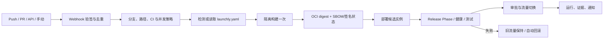

# Launchly 产品设计规范

> **版本**：4.2
> **生效日期**：2026-08-13
> **地位**：Launchly 产品定位、术语、范围与优先级的唯一权威。技术实现以[技术架构规范](./技术架构规范.md)为准，界面以[UI 与交互规范](./UI与交互规范.md)为准，是否完成以[交付验收规范](./交付验收规范.md)的可复跑证据为准，实施顺序见[项目重启路线图](./项目重启路线图.md)。
> **状态声明**：本文描述目标产品，不表示当前代码已经实现。没有验收记录的能力必须显示为“规划中”或“未验收”。

## 1. 产品定位

**Launchly 是中文优先、面向小团队的 BYOS 发布控制面。**

它连接 Git 提供方与现有 CI，把通过检查的代码或 OCI 制品安全地发布到用户自己的 Linux/NAS 服务器，并在一个上下文里管理环境、审批、流量、健康、回滚、运行状态和发布证据。

一句话承诺：

> 把通过 CI 的每个提交，清楚、可靠、可回滚地送到自己的服务器。

### 1.1 目标用户与核心任务

| 用户 | 典型处境 | Launchly 必须解决的任务 |
| --- | --- | --- |
| 个人开发者 | 有 VPS/NAS，不想反复 SSH 手工部署 | 10 分钟内完成首次部署；Push 后自动更新；失败能恢复 |
| 5–20 人产品团队 | CI 已在 GitHub/GitLab，缺少统一 CD 和环境治理 | 看清每个环境运行什么；审批并晋级同一制品；保留证据 |
| 小团队负责人 | 没有专职 DevOps，担心误发布和不可追责 | 获得中文诊断、门禁、回滚、节点健康和审计记录 |

### 1.2 北极星体验

1. **首次上线**：连接仓库或 OCI 镜像，验证一台 BYOS 节点，确认检测到的构建计划，在 10 分钟内获得可访问地址。
2. **持续交付**：Push/PR 触发后，Launchly 验签、去重、等待 CI、构建一次并部署；用户无需登录服务器。
3. **安全晋级**：同一个 digest 制品从测试晋级到预发和生产，不在不同环境重复构建。
4. **失败恢复**：用户能立即看到失败阶段、原因、影响和下一步；候选版本失败不影响旧流量，并可恢复上一成功快照。
5. **发布证明**：一次发布能回答“谁、何时、把哪个 commit/制品、用哪版配置、经过哪些检查，发布到了哪里”。

### 1.3 产品边界

Launchly **不做**：

- Git 托管和代码评审平台。
- GitHub Actions/GitLab CI 的通用替代品；不提供任意 Job、矩阵和插件式 CI DSL。
- Kubernetes、Service Mesh 或企业级流水线套件的默认入口。
- 通用项目管理和完整 Issue Tracker。
- 默认由 Launchly 托管的应用运行时。
- 在可靠部署闭环完成前建设 Cloud 计费、多租户或大规模模板市场。
- 默认开放高风险的浏览器终端。

GitHub Actions、GitLab CI 等负责代码检查、单测和扫描；Launchly 消费其结果并负责 **CD、BYOS 运行和发布治理**。

## 2. 差异化原则

| 原则 | 产品约束 |
| --- | --- |
| 中文可操作 | 不只翻译字段；错误必须说明现象、原因、影响和下一步，用户不看英文日志也能完成主路径 |
| BYOS 可诊断 | 节点不是 SSH 地址台账；必须展示连通性、Docker/Compose、架构、容量、磁盘、代理和运行应用 |
| 构建一次，逐级晋级 | 测试、预发和生产引用同一 OCI digest；任何重新构建都产生新制品和新证据链 |
| 发布证据一体化 | CI、测试、安全扫描、审批、豁免、配置版本、部署和回滚属于同一发布证据页 |
| 小机可用 | 默认不依赖 Kubernetes、ELK 或 Prometheus/Grafana 全家桶；重型观测仅作为可选集成 |
| 诚实状态 | 页面、表、接口、Mock 或单测不代表能力完成；完成必须关联真实验收记录 |

## 3. 用户可见领域模型

```text
Workspace
  ├── Applications（应用；数据库迁移期可沿用 Project）
  │   ├── Services（可部署服务；数据库迁移期可沿用 Component）
  │   ├── Environments（测试 / 预发 / 生产）
  │   ├── Preview Environments（PR 临时环境）
  │   ├── Artifacts（不可变 OCI 制品）
  │   ├── Deployments（一次部署尝试）
  │   ├── Releases（制品晋级决策）
  │   ├── Domains / Routes
  │   └── Evidence / Blockers / Audit Events
  └── Infrastructure
      ├── BYOS Nodes / Agent registrations
      └── Shared proxy / capacity / diagnostics
```

### 3.1 术语定义

| 术语 | 定义 | 不能混淆为 |
| --- | --- | --- |
| 应用 Application | 一个产品或仓库的治理边界 | 单个容器 |
| 服务 Service | Web、API、Worker、静态站点等可部署单元 | Workspace 或环境 |
| 环境 Environment | 长期存在的测试、预发、生产阶段及其策略 | 某台服务器 |
| Preview | 绑定 PR 的临时隔离环境，有 TTL 和回收策略 | 长期预发环境 |
| 制品 Artifact | commit 构建得到的不可变 `image@sha256` 及其元数据 | 可变 tag 或一次部署 |
| 部署 Deployment | 把一个制品和配置版本放入某环境的一次尝试 | 发布审批 |
| 发布 Release | 将已验证制品晋级到更高环境的决策和证据 | 重新构建 |
| 节点 Node | 实际承载应用的 BYOS 服务器 | 环境 |
| 阻断项 Blocker | 与部署/发布直接关联、会阻止晋级的问题 | 通用项目管理 Issue |

任何项目级资源 API 都必须同时验证 Workspace、Application/Project、资源归属和角色；URL 中有 `projectId` 不能替代服务端授权。

## 4. 端到端产品闭环


```mermaid
flowchart LR
  A[Push / PR / API / 手动] --> B[Webhook 验签与去重]
  B --> C[分支、路径、CI 与并发策略]
  C --> D[检测或读取 launchly.yaml]
  D --> E[隔离构建一次]
  E --> F[OCI digest + SBOM/签名状态]
  F --> G[部署候选实例]
  G --> H[Release Phase / 健康 / 测试]
  H --> I[审批与流量切换]
  I --> J[运行、证据、通知]
  H -->|失败| K[旧流量保持 / 自动回滚]
```

### 4.1 触发与并发策略

- 支持 Push、PR、手动和 API 触发；手动触发是受审计的逃逸入口。
- 环境可配置分支、路径过滤、CI 必须通过、审批和部署冻结窗口。
- 同一应用与环境支持三种并发策略：`queue_all`、`latest_only`、`cancel_previous`。
- 重复 delivery、commit、环境和触发语义必须幂等。
- CI 阻断、忽略和跳过都必须留下事件，并向 Git 提供方回写可理解的状态。

### 4.2 自动检测与构建计划

连接仓库后检测 monorepo、Dockerfile、Compose、常见框架、端口、启动命令和健康路径，并在首次执行前展示“构建计划预览”。用户必须能看见检测依据并修改结果；Launchly 不得静默猜测生产命令。

复杂或长期配置可写入仓库根目录的轻量 `launchly.yaml`。该文件只描述服务、构建、运行、健康、环境和发布策略，不扩展成通用 CI DSL；UI 必须能验证并展示其生效结果。

### 4.3 制品与环境晋级

- 每个制品记录 commit、来源、构建计划版本、digest、创建者、SBOM/签名/扫描状态。
- 测试、预发、生产默认晋级同一 digest；重新构建必须生成新的 Artifact ID。
- 环境记录当前制品、当前配置版本、目标节点、域名、健康和上一成功快照。
- 晋级前展示与目标环境当前版本的代码、制品、配置引用、域名和资源差异。

### 4.4 Preview 环境

- 可按 PR 自动或手动创建，使用隔离名称、网络、目录和动态 URL。
- 支持目标分支、PR 标签、monorepo 路径过滤、最大数量和 TTL。
- PR 新提交更新 Preview；关闭或合并后自动清理容器、路由和临时密钥。
- 公共仓库的外部 PR 默认禁止在受信 BYOS 节点执行，除非显式采用隔离构建策略。
- Preview 默认不复制生产数据；种子数据必须由显式初始化步骤产生。

### 4.5 部署、流量与回滚

部署阶段至少包括：

`QUEUED → PLANNING → WAITING_FOR_CI → BUILDING → RELEASE_PHASE → DEPLOYING → VERIFYING → WAITING_APPROVAL → SWITCHING → SUCCEEDED`

未启用的阶段可跳过，但必须显示原因。失败进入 `FAILED`；有上一成功快照时进入 `ROLLING_BACK → ROLLED_BACK`。

产品必须区分：

- **重启**：同一制品和同一配置重新启动实例。
- **重部署**：同一制品重新执行部署与验证。
- **重建**：从源码产生新制品。
- **回滚**：恢复目标制品、配置引用、运行清单和路由快照。

健康、迁移或门禁失败不得切换流量。基础版本至少提供原子候选切换；蓝绿和小流量 Canary 属于后续能力。

## 5. 功能域

### 5.1 发布指挥中心

首屏展示需要行动的事项，而不是项目总数等装饰性统计：运行中的部署、等待审批、未处理失败、自动回滚、异常节点、磁盘/证书风险和下一步操作。

### 5.2 应用与运行

应用总览以环境泳道展示测试、预发和生产当前运行的制品、配置、域名、健康、最近部署及晋级差异。运行页提供实例状态、结构化事件、脱敏日志和轻量 CPU/内存/磁盘信息。

### 5.3 基础设施中心

节点必须展示在线状态、Agent/SSH 模式、CPU/内存/磁盘、Docker/Compose/架构、工作目录、代理、运行应用和最近异常，并支持验证、暂停调度、排空和中文诊断报告。

### 5.4 发布证据与阻断项

Release 聚合 commit/PR、CI Checks、测试、安全扫描、审批、豁免、制品、配置版本、环境晋级、部署结果和回滚点。内置 Issue 收敛为“发布阻断项/部署事故”，通用研发任务优先与 GitHub Issues 等外部系统集成。

### 5.5 通知与集成

基础渠道为站内、邮件和通用 Webhook；中文团队优先支持飞书、钉钉、企业微信，随后支持 Slack。通知依据结构化事件和订阅策略发送，必须去重、可重试并显示投递状态。

## 6. 权限与安全体验

- Workspace 角色与应用级成员权限共同生效；Owner 也不能绕过资源归属检查。
- 生产审批默认禁止触发人自审；紧急绕过必须要求原因并写审计。
- 环境密钥仅在门禁通过、任务领取后短时交给执行面；Web、普通 API、任务日志和导出不得返回明文。
- 所有敏感变更展示影响范围和二次确认；前端隐藏按钮不是权限控制。
- Web Terminal、任意宿主命令和 root SSH 不进入基础版本。

## 7. 版本优先级

| 阶段 | 产品结果 | 当前状态（基线 `873bbd6`） |
| --- | --- | --- |
| R0 可信基线 | 能构建、能启动、权限隔离、迁移可验证，文档与状态一致 | **进行中；存在已知启动与授权阻断** |
| R1 首次部署 | 空白机安装、节点诊断、已有 OCI digest 首次上线 | 未验收 |
| R2 持续交付 | GitHub App、Webhook、CI/分支/路径/并发策略、状态回写 | 未验收 |
| R3 安全生产 | 隔离构建、构建一次逐级晋级、HTTPS、健康、流量切换、真实回滚 | 未验收 |
| R4 Preview 与 Monorepo | PR 临时环境、TTL/配额/回收、受影响服务部署 | 未验收 |
| R5 发布治理 | 发布证据、阻断项、审批、通知、轻量观测 | 未验收 |
| R6 多节点与 Cloud | Agent、多节点调度；Self-Host 稳定后再评估 Cloud | 未开始 |

详细任务、依赖和退出条件见[项目重启路线图](./项目重启路线图.md)。

## 8. 成功指标

- 空白 Ubuntu/NAS 从安装到首个 OCI 应用可访问的中位时间不超过 10 分钟。
- 自动部署失败时旧版本可用率为 100%，且用户在一个页面内找到失败阶段和恢复操作。
- 测试到生产的晋级中，制品 digest 不发生变化。
- 所有生产发布都有可导出的证据记录，且敏感信息扫描为零泄漏。
- 用户无需阅读英文原始日志即可完成安装、首次部署、失败恢复和回滚主路径。

## 9. 变更与完成规则

1. 先更新产品、技术、UI、验收和路线图，再改代码。
2. “代码存在”“编译通过”“单测通过”“页面可见”均不得单独标记为完成。
3. 每项完成声明必须关联版本/commit、验收环境、命令、脱敏日志和结果。
4. AI 或人工审计报告只能作为线索；没有独立复核的自述不能改变进度状态。

## 修订记录

| 版本 | 日期 | 说明 |
| --- | --- | --- |
| 4.2 | 2026-08-13 | 同步 TEST-API-01 验收后的当前代码基线；产品范围和阶段状态不变 |
| 4.1 | 2026-08-13 | 同步 TEST-000 验收后的当前代码基线；产品范围和阶段状态不变 |
| 4.0 | 2026-08-13 | 定位收敛为 BYOS 发布控制面；明确 CI/CD 边界、应用/服务/制品/部署/发布模型、构建一次逐级晋级、Preview、并发策略、发布证据与重启阶段 |
| 3.3 | 2026-07-24 | 增加被部署应用初始化管理员契约 |
| 3.0 | 2026-07-22 | 改为 BYOS 自动应用运行平台并加入真实验收边界 |
| 2.0 | 2026-05-13 | 历史版本：双模式轻量部署平台 |
