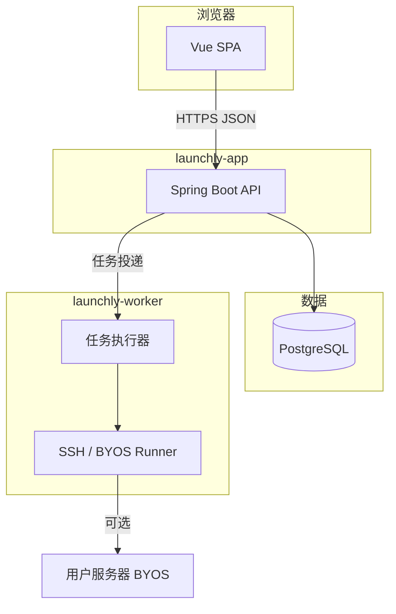
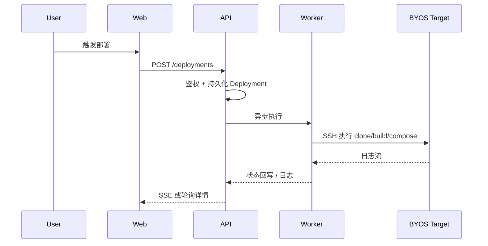

# Launchly 技术架构规范

> **版本**：2.0  
> **生效日期**：2026-05-13  
> **地位**：工程实现唯一权威（架构、栈、模块边界、运行时行为）；产品意图见 [产品设计规范](./产品设计规范.md)。  
> **历史**：v1 PRD 技术章节等见 [docs/archive/v1-2026-05](../archive/v1-2026-05/README.md)。

---

## 1. 技术栈（锁定）

| 层 | 技术 |
| --- | --- |
| Web | Vue 3 + TypeScript + Vite + Ant Design Vue + Pinia + vue-router + axios |
| API | Java 17 + Spring Boot 3 + JPA + Flyway + PostgreSQL |
| Worker | Java 17 + Spring Boot 3，BYOS 时经 **SSH** 在目标机执行构建/部署 |
| CLI | Go（Self-Host 安装/运维） |
| 部署模板 | Docker Compose（内置 Postgres / App / Worker 等） |

**禁止**（除非 [planning.md](../work/planning.md) 批准的新任务显式允许）：新语言后端、新前端框架、Redis/Kafka/ES 等额外中间件。

---

## 2. 仓库顶层结构

```text
apps/web              Web UI
services/api          REST API + 认证 + 业务域
services/worker       异步部署/任务执行
cli                   launchly CLI（Self-Host）
deploy/compose        Compose 模板
docs/basic            产品设计规范 / 技术架构规范 / UI与交互规范
docs/work             planning.md、phase1/weekNN/
docs/prototypes       静态 HTML 原型
docs/archive          历史文档
```

---

## 3. 逻辑架构



---

## 4. 部署请求路径（简化时序）



---

## 5. 领域模块（API 分包示意）

与归档 PRD 及当前代码对齐：`auth`、`workspace`、`project`、`environment`、`deployment`、`target`（DeployTarget）、`testcase`、`issue`、`release`、`notification`、`audit`、`common` 等。**敏感字段**：加密存储 + 脱敏返回。

---

## 6. 版本与配置开关

- **EDITION**：`cloud` | `selfhost`（编译时或运行时），控制 SaaS 独有与 CLI 独有代码路径。
- **BYOS**：MVP 执行路径；Worker **不得**依赖 SaaS 侧挂载宿主 `docker.sock` 作为默认执行模型（Self-Host 亦应以 SSH 到目标为规范执行面）。

---

## 7. 安全与运维要点

- 所有远程命令：**超时、日志、可审计**。
- 用户输入：**jakarta.validation** 校验。
- Schema 变更：**仅通过 Flyway** 新版本脚本。
- 凭据：**加密 at rest**；日志与 UI **脱敏**。

---

## 8. 构建与本地运行

以根目录 [README.md](../../README.md) 为准（`pnpm`、`mvn`、数据库前置等）；本文不重复命令细节以免双处维护。

---

## 9. 与产品/UI 文档边界

| 主题 | 文档 |
| --- | --- |
| 页面、交互、视觉 | [UI 与交互规范](./UI与交互规范.md) |
| 商业、权限、流程意图 | [产品设计规范](./产品设计规范.md) |
| 阶段与周索引 | [planning.md](../work/planning.md) |

---

## 10. 修订记录

| 版本 | 日期 | 说明 |
| --- | --- | --- |
| 2.0 | 2026-05-13 | 首版 2.0：从归档 PRD §6 与 README 抽取并收敛 |
