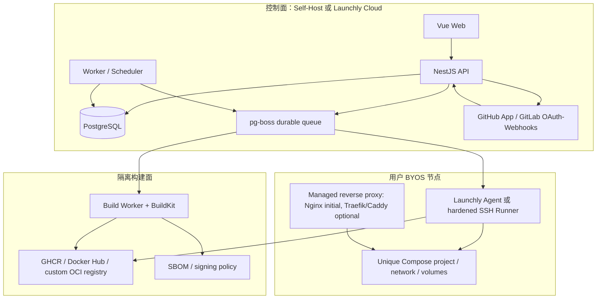

# Launchly 技术架构规范

> **版本**：4.0
> **生效日期**：2026-07-22
> **地位**：工程架构唯一权威；产品目标见[产品设计规范](./产品设计规范.md)，完成判定见[交付验收规范](./交付验收规范.md)。目标架构与当前实现不一致的部分必须按 P1–P7 迁移，不能以文档宣布完成。

## 1. 架构原则

- 控制面、任务执行面和用户应用运行面必须隔离；API 容器不得挂载或直接使用宿主 Docker Socket。
- API 与 Worker 必须是独立进程/服务；Worker 崩溃不得中断控制面。
- PostgreSQL 是业务数据库和可靠任务队列的持久化基础。使用 pg-boss 或等价 PostgreSQL 队列，实现租约、幂等键、重试、超时、死信与可恢复消费。
- 构建在独立 Build Worker 的受限 BuildKit 环境进行；部署节点只拉取经 digest 固定的 OCI 镜像。
- SSH Runner 仅为第一阶段执行面；长期目标是由 Launchly Agent 主动领取任务、心跳、流式日志和最小权限执行，SSH 只用于首次安装 Agent。
- 轻量化优先于组件数量：不得为“看起来完整”默认部署 Kubernetes、服务网格、日志/指标全家桶或每个项目一套代理。观测以部署事件、健康结果与脱敏日志为主；重型指标/日志后端只能是显式可选集成。

## 2. 目标拓扑

```mermaid
flowchart TB
  subgraph CP["控制面：Self-Host 或 Launchly Cloud"]
    WEB["Vue Web"] --> API["NestJS API"]
    API --> PG[("PostgreSQL")]
    API --> Q["pg-boss durable queue"]
    WORKER["Worker / Scheduler"] --> Q
    WORKER --> PG
    API --> GIT["GitHub App / GitLab OAuth-Webhooks"]
  end
  subgraph BUILD["隔离构建面"]
    BW["Build Worker + BuildKit"] --> REG["GHCR / Docker Hub / custom OCI registry"]
    BW --> SBOM["SBOM / signing policy"]
  end
  subgraph BYOS["用户 BYOS 节点"]
    AGENT["Launchly Agent 或 hardened SSH Runner"] --> REG
    AGENT --> RT["Unique Compose project / network / volumes"]
    RP["Managed reverse proxy: Nginx initial, Traefik/Caddy optional"] --> RT
  end
  Q --> BW
  Q --> AGENT
  GIT --> API
```

API 提交部署意图、事件和幂等键后即返回；Worker 独立领取任务。任务由数据库事务中的状态变迁驱动，使用可见的 lease owner / lease expiry，不得使用进程内定时器作为唯一可靠性机制。

## 3. Git 事件与部署编排

1. GitHub App 安装后保存 App/installation 关联；个人 PAT 仅作为受限兼容方案，不能是默认方案。
2. Webhook 先使用常量时间 HMAC 校验，再验证事件 schema、delivery ID、仓库安装关系和分支规则。
3. 用唯一约束/幂等键 `(provider, deliveryId)` 与 `(project, environment, commitSha, triggerKind)` 去重；重放只返回已有部署。
4. 查询 Git commit/CI 状态；若环境策略要求且 CI 未通过，记录被阻止的部署事件而不进入构建。
5. 构建产出 `registry/repository@sha256:...`，并同时记录 commit SHA、deployment ID、SBOM 与签名状态；严禁以 `latest` 作为部署输入。
6. Release Phase（含迁移）成功、候选实例健康、所需测试/门禁通过后才切换路由；失败保持旧版本流量并回滚候选资源。

## 4. 执行面和隔离

- 每个部署运行目录使用稳定且可验证的标识：`<target.workRoot>/apps/<project>/<environment>/<deployment>`；普通 Linux 目标默认 `target.workRoot=/var/lib/launchly`。NAS/受限系统可在目标配置中改为部署用户与 Docker 均可读写的持久共享目录；不可写入共享 `/tmp/docker-compose.yml` 或临时盘。
- Compose project、network、service/volume/resource 名称必须来自经白名单规范化的内部 ID，不能将 host、username、port、环境变量或用户命令直接拼入 shell。
- 远程传输、`docker save`、SCP、`docker load`、镜像拉取、Compose、迁移与健康检查的每一步都必须检查退出码；任一失败停止后续步骤并写入脱敏事件。
- SSH 默认密钥认证，禁用 root 默认用户和密码默认路径；已登记的目标必须严格校验预存 Host Key/指纹，禁止 `StrictHostKeyChecking=accept-new`。
- 构建限制 CPU、内存、磁盘、网络、执行时间和清理配额；构建凭据不可写入镜像层、日志或任务 payload。
- 域名是环境级路由而非应用端口。填写 `app.example.com` 后，Runner 必须在目标机维护一个共享反向代理和隔离网络，将该域名转发到项目/环境专属容器别名；多个项目共享 80/443，不要求用户手工编写 Nginx 配置。应用的 `externalPort` 仅作回退访问和健康检查端口。
- 当前初始实现自动维护 HTTP Nginx 路由；HTTPS 必须在引入受控 ACME 证书生命周期和真实域名 E2E 后才可标为已启用，不能因 HTTP 路由成功而宣称 HTTPS 完成。
- 部署目标“验证连接”除 SSH 和固定 Host Key 外，必须验证 Docker、Docker Compose v2、Docker 架构、工作目录可写性与可用磁盘空间；任一项失败不得标记为可部署。这使 NAS 等厂商 Linux 可在创建目标时暴露兼容性问题，而不是发布中途才失败。

## 5. 自托管交付

Self-Host 的生产镜像必须包含已构建的 Web SPA 和 API，并支持 `/setup` 及 SPA 历史路由回退。启动顺序为：PostgreSQL 就绪 → `prisma migrate deploy` 成功 → API 就绪；迁移失败必须使服务退出，不能启动旧 schema 上的 API。

Compose 至少拆分 `web/api`、`worker`、`postgres`，并配置独立 healthcheck。Build 执行器按安全模型独立运行，不能通过将 `/var/run/docker.sock` 挂入 API 规避隔离。CLI 安装器必须可在空白 Ubuntu 上重复执行，且提供升级、备份、恢复、磁盘清理和诊断路径。

Self-Host 必须定义并验证两档资源画像，而非默认要求企业级服务器：

| 画像 | 目标用途 | 约束 |
| --- | --- | --- |
| Lite | 小团队控制面、拉取既有 OCI 镜像、低频发布 | 控制面与共享代理可在 1 vCPU / 2 GB RAM 级服务器空闲运行；本机大型构建可明确拒绝或转交独立构建节点，不能静默 OOM。 |
| Standard | 本机 BuildKit 构建与多个常驻应用 | 推荐 2 vCPU / 4 GB RAM 起；构建任务必须有资源/时间/磁盘限制，不能挤占 API、Worker 和 PostgreSQL。 |

这些是验收目标，不是当前资源占用声明；必须在空白 Ubuntu 真实测量空闲内存、构建峰值、启动时间及三项目并存场景后才能对外承诺。

发布到 GHCR 必须构建多阶段生产镜像、生成 SBOM、按 commit/version 标记、签名，并在干净环境拉取和启动验证。签名和扫描可分阶段引入，但其状态不得伪报为已启用。

## 6. 安全、密钥与可观测性

- 主密钥与 JWT 密钥必须分离；使用版本化 AES-256-GCM 信封格式，支持新主密钥重新加密和旧密钥读取迁移。空值或开发默认密钥不能用于生产启动。
- 在入口、任务日志和审计导出中统一脱敏 token、password、private key、connection string、环境变量值和 bearer header；脱敏应基于结构化字段与值注册表，正则仅作兜底。
- 审计事件为 append-only，记录 actor、workspace/project、action、对象、请求/部署关联、时间与结果；不可由普通业务更新覆盖。
- API、Worker、PostgreSQL、Build Worker、Agent/Runner、反向代理分别提供存活与就绪检查；告警与通知依据结构化事件，而非页面轮询推断。

## 7. 数据与演进边界

Prisma schema/migrations 要新增 Git provider installation、webhook delivery、artifact digest/SBOM、deployment attempt/lease、release phase、domain/route、target host key/agent 与不可变审计等实体及唯一约束。迁移必须先在空库和升级库验证；迁移失败时不切流量。

Cloud 多租户、注册、邀请、配额、计费与 Agent 控制通道当前均未实现。`LAUNCHLY_EDITION` 只能选择已实现的部署配置，绝不能将未实现的 Cloud 功能伪装成可用。

## 8. 迁移顺序

P0 文档与验收 → P1 Self-Host 镜像/迁移/CLI/GHCR → P2 GitHub App/Webhook → P3 独立 Worker/BuildKit/OCI → P4 隔离/域名/HTTPS/回滚 → P5 发布治理联动 → P6 Agent/多服务器/Cloud → P7 真实 E2E 和安全恢复验收。每阶段合入前同时更新实现、迁移、测试和验收记录。

## 修订记录

| 版本 | 日期 | 说明 |
| --- | --- | --- |
| 4.0 | 2026-07-22 | 以独立 Worker、BuildKit、不可变 OCI、Agent 与真实回滚替换历史单进程/SSH 本地构建架构 |
| 4.1 | 2026-07-23 | 定义环境级自动 Nginx 域名路由与 HTTP/HTTPS 的诚实边界 |
| 3.0 | 2026-06-03 | 历史版本：NestJS + Prisma 单进程 Worker |
