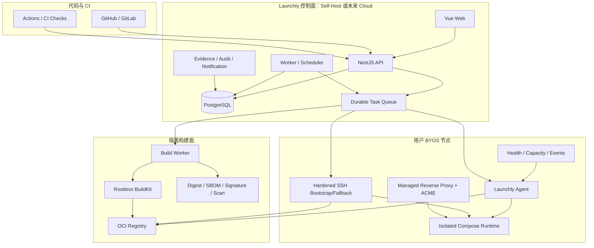

# Launchly 技术架构规范

> **版本**：5.8
> **生效日期**：2026-08-13
> **地位**：Launchly 工程架构、数据边界和运行约束的唯一权威。产品范围见[产品设计规范](./产品设计规范.md)，交付证据见[交付验收规范](./交付验收规范.md)，迁移顺序见[项目重启路线图](./项目重启路线图.md)。
> **状态声明**：本规范描述目标架构；基线 `a2f7b5b` 仅是待修复和复用的代码基础，不能据此宣称目标已交付。

## 1. 架构决策

1. **CI 与 CD 分离**：GitHub Actions/GitLab CI 负责代码检查；Launchly 消费 Check 结果，负责制品、环境、部署、运行和发布治理。
2. **控制面与执行面分离**：API 不运行构建或宿主命令，不挂载 Docker Socket；Worker、Build Worker、Agent/SSH Runner 分担执行职责。
3. **构建一次、逐级晋级**：源码只在 Build Worker 生成一次 OCI digest；测试、预发和生产复用同一制品。
4. **状态由数据库持久化**：部署意图、阶段、租约、审批、证据和回滚必须可恢复；进程内定时器不能成为唯一状态来源。
5. **所有写入有边界**：Workspace、Application/Project、资源 ID 和角色必须在每个项目级 API 中联合校验。
6. **轻量默认**：Self-Host 默认使用 PostgreSQL、API、Worker、共享代理；BuildKit、Agent 和重型观测按能力启用，不引入 Kubernetes。
7. **可验证优先**：架构图、类和模块只代表目标或代码路径，实际完成以真实环境证据为准。

## 2. 目标拓扑


```mermaid
flowchart TB
  subgraph GIT["代码与 CI"]
    PROVIDER["GitHub / GitLab"]
    CHECKS["Actions / CI Checks"]
  end

  subgraph CP["Launchly 控制面：Self-Host 或未来 Cloud"]
    WEB["Vue Web"] --> API["NestJS API"]
    API --> PG[("PostgreSQL")]
    API --> QUEUE["Durable Task Queue"]
    SCHED["Worker / Scheduler"] --> QUEUE
    SCHED --> PG
    EVIDENCE["Evidence / Audit / Notification"] --> PG
  end

  subgraph BUILD["隔离构建面"]
    BW["Build Worker"] --> BK["Rootless BuildKit"]
    BK --> REG["OCI Registry"]
    BW --> SUPPLY["Digest / SBOM / Signature / Scan"]
  end

  subgraph BYOS["用户 BYOS 节点"]
    AGENT["Launchly Agent"] --> RUNTIME["Isolated Compose Runtime"]
    SSH["Hardened SSH Bootstrap/Fallback"] --> RUNTIME
    PROXY["Managed Reverse Proxy + ACME"] --> RUNTIME
    NODEOBS["Health / Capacity / Events"] --> AGENT
  end

  PROVIDER --> API
  CHECKS --> API
  QUEUE --> BW
  QUEUE --> AGENT
  QUEUE --> SSH
  AGENT --> REG
  SSH --> REG
```

### 2.1 进程职责

| 进程 | 可以做 | 不可以做 |
| --- | --- | --- |
| Web | 展示、输入、订阅状态 | 持有部署密钥、决定权限 |
| API | 鉴权、校验、创建意图、查询状态 | 直接构建、SSH、操作 Docker |
| Worker/Scheduler | 领取任务、驱动状态机、安排重试/超时 | 作为唯一状态存储 |
| Build Worker | 检出、构建、推送、产出供应链元数据 | 访问生产环境密钥 |
| Agent | 在已授权节点执行部署、健康、日志和回滚 | 接受任意未签名宿主命令 |
| SSH Runner | 首期部署与 Agent 引导的受限兼容路径 | root/密码默认登录、跳过 Host Key |

## 3. 数据模型与权威关系

数据库可以在迁移期沿用 `Project`/`Component`，API 和 UI 目标术语为 `Application`/`Service`。

| 实体 | 关键关系和不变量 |
| --- | --- |
| Workspace | 所有业务资源的授权根；资源查询必须带 workspace 边界 |
| Application/Project | 治理边界，关联 Git installation、配置和成员 |
| Service/Component | 单个可部署单元；monorepo 可有多个服务及路径过滤 |
| Environment | 长期环境策略；不能等同于 Node |
| PreviewEnvironment | PR + Service + 唯一 URL + TTL；关闭后可证明清理 |
| BuildPlanRevision | 自动检测或 `launchly.yaml` 解析后的不可变计划版本 |
| ConfigRevision | 非明文配置快照，保存密钥引用和非敏感差异 |
| Artifact | `imageRef@digest`、commit、BuildPlan、SBOM/签名/扫描状态；不可变 |
| Deployment | Artifact + ConfigRevision + Environment + Node 的一次尝试 |
| DeploymentStage | 独立状态、输入/输出摘要、时间、重试和脱敏日志 |
| Release | Artifact 在环境间晋级的决策，不产生新构建 |
| GateEvaluation | CI、测试、安全、审批和冻结窗口的结构化结果 |
| Evidence | 可导出的发布证据引用；不复制密钥和完整日志 |
| Node | BYOS 能力、标签、容量、Agent/SSH 状态和调度状态 |

外键、唯一约束和服务层授权必须共同保证：

- 同一 Git delivery 只能处理一次。
- 同一应用、环境、commit、触发类型的幂等请求只返回一个部署意图。
- Artifact digest 和构建元数据不可更新为另一份制品。
- Deployment 引用的 Artifact、Environment、ConfigRevision 和 Node 必须属于同一 Workspace/Application 边界。
- 子资源的 URL `projectId` 必须与数据库真实父资源一致。

## 4. Git、CI 与配置解析

### 4.1 GitHub App 与 Webhook

1. 以 installation/repository ID 为主键映射应用，不能全表扫描后只按 URL 选择第一个项目。
2. 在解析业务字段前验证原始请求体 HMAC、delivery ID、事件类型和 payload schema。
3. delivery 使用数据库唯一约束去重；重复请求返回原记录，不重复部署。
4. Token 短时获取、内存使用，不进入数据库、任务 payload、URL 日志或异常详情。
5. CI 未通过时记录结构化阻断事件，并向 Git 提供方回写状态和可跳转的 Launchly URL。

### 4.2 Build Plan

构建计划来源优先级：

1. 仓库内 `launchly.yaml`。
2. 用户确认并保存的计划版本。
3. 首次仓库检测建议。

检测器可以读取 Dockerfile、Compose、package manifest 和 monorepo 配置，但检测结果必须展示依据并由用户确认。执行时只读取已冻结的 BuildPlanRevision，不能在重试中重新猜测。

`launchly.yaml` 只允许声明：服务、构建上下文、Dockerfile/受控构建器、端口、健康、路径过滤、环境策略和 Release Phase。禁止任意宿主 Job、无边界插件和动态提权。

## 5. 部署编排与并发

### 5.1 状态机

目标主状态：

```text
QUEUED
  → PLANNING
  → WAITING_FOR_CI
  → BUILDING
  → RELEASE_PHASE
  → DEPLOYING
  → VERIFYING
  → WAITING_APPROVAL
  → SWITCHING
  → SUCCEEDED
```

失败路径：`FAILED → ROLLING_BACK → ROLLED_BACK | ROLLBACK_FAILED`。取消路径必须区分 `CANCELED_BEFORE_START` 与 `CANCELED_DURING_RUN`。

每个阶段都要保存：attempt、lease、输入摘要、输出引用、开始/结束时间、错误分类、重试原因和脱敏日志。状态转换使用事务或比较更新，不能由多个 Worker 无条件覆盖。

### 5.2 并发策略

以 `(application, service, environment)` 为并发组：

- `queue_all`：全部依次执行。
- `latest_only`：保留正在执行项和最新等待项，中间提交标为跳过。
- `cancel_previous`：安全取消旧候选后执行最新项；已切流量阶段不得直接杀死。

Webhook 去重与并发策略是两层能力：前者处理重复事件，后者处理不同 commit 的合法竞争。

### 5.3 操作语义

- restart：同一 Artifact + ConfigRevision，不进入构建。
- redeploy：同一 Artifact + ConfigRevision，重走部署/验证。
- rebuild：生成新 BuildPlan 执行或新 Artifact。
- rollback：恢复目标 Artifact、ConfigRevision、运行清单和路由快照；不得仅创建“旧 commit 的普通部署”。

## 6. 构建与制品供应链

- Build Worker 使用受限、默认 rootless 的 BuildKit；按任务限制 CPU、内存、磁盘、网络、超时和缓存配额。
- 构建凭据通过 BuildKit secret/SSH mount 短时提供，不写入层、构建参数或日志。
- 推送后以 Registry 返回的 digest 为准创建 Artifact；tag 仅用于展示，部署输入必须为 digest。
- Artifact 记录 commit、source revision、BuildPlanRevision、构建器版本、平台架构、SBOM、签名和扫描状态。
- 测试、预发、生产只能晋级 Artifact；任何重新构建都会生成新的证据链。
- Registry 凭据作为 Workspace/Node 有作用域的 SecretRef 管理，支持轮换和最小权限。

## 7. BYOS 运行面

### 7.1 隔离

每个 Service/Environment 使用稳定内部 ID 生成唯一 Compose project、容器、网络、运行目录和受控卷。部署目录为：

```text
<node.workRoot>/apps/<application>/<service>/<environment>/<deployment>
```

用户输入不能直接参与 shell、路径、容器名或网络名；必须经过类型校验、白名单和参数化执行。临时私钥使用独立 `0700` 目录，正常退出清理，并由启动恢复任务清理崩溃残留。

### 7.2 流量、健康与 HTTPS

- 节点共享一个受控反向代理，环境路由到候选/当前服务别名。
- 候选实例通过 Release Phase、readiness、必需测试和审批后，才原子更新路由。
- 旧实例在观察窗口内保留；失败不切流量或恢复上一快照。
- HTTPS 由受控 ACME 生命周期管理，需验证签发、续期、重启恢复和证书失败告警。
- 有持久卷的服务必须明确零停机限制、备份、恢复和 migration policy。

### 7.3 Node 与 Agent

Node 验证至少检查 Host Key、Docker、Compose v2、CPU 架构、工作目录、磁盘、端口、代理和拉取 Registry 能力。Agent 使用出站连接、节点身份和短期任务授权，支持心跳、能力、容量、排空、日志流和版本状态。SSH 是 R1–R3 兼容路径，长期主要用于首次安装/修复 Agent。

## 8. Preview 生命周期

Preview 由 PR 事件驱动，使用专属 Environment、路由和 ConfigRevision。必须实现：

- PR/服务/commit 幂等。
- 目标分支、标签、路径过滤、并发上限和 TTL。
- 新 commit 更新，关闭/合并自动清理。
- 外部 fork 默认不执行受信密钥和不接触生产网络。
- 清理失败可重试并在指挥中心形成待办。

## 9. 权限、密钥与审计

- JWT 中的 Workspace 只提供请求上下文；每次资源访问仍需数据库验证归属。
- 项目子资源 Controller 不得直接凭任意 ID 查询；统一调用 AccessPolicy 或使用带 workspace/project 条件的 repository。
- 所有写 DTO 使用显式 schema，`whitelist` 不能弥补 `any` body。
- 主密钥、JWT 密钥、GitHub App 私钥和 Registry/SSH 密钥分离；生产不允许默认值。
- Secret 使用版本化 AES-256-GCM 信封和 SecretRef；轮换必须有重加密和回滚演练。
- 结构化字段与已注册敏感值优先脱敏，正则只作兜底。
- 审计 append-only，记录 actor、workspace/application、动作、对象、关联部署、结果和时间；审批人、触发人、豁免人不可被后续更新覆盖。

## 10. 证据、可观测与通知

API、Worker、Build Worker、PostgreSQL、Agent、代理和应用分别提供 liveness/readiness。基础观测保存结构化部署事件、健康结果、容器重启、节点 CPU/内存/磁盘和脱敏日志索引，不强制常驻重型监控。

通知采用 Outbox/等价可靠事件模式，具备幂等键、重试、退避和投递状态。Release Evidence 只引用 CI、测试、扫描、审批、Artifact、ConfigRevision、Deployment 和 AuditEvent，不复制秘密。

## 11. Self-Host 交付

启动顺序：PostgreSQL 就绪 → migration 成功 → API/Worker 分别就绪 → `/setup` 可用。生产镜像必须包含正确构建的 SPA 和 API 入口；编译成功不能替代镜像启动验证。

| 画像 | 目标 | 验收约束 |
| --- | --- | --- |
| Lite | 控制面 + 已有 OCI 制品部署 | 1 vCPU / 2 GB 级空闲可运行；构建可转交外部 Build Worker |
| Standard | 本机受限构建 + 多应用 | 建议 2 vCPU / 4 GB 起；构建不能拖垮 API、Worker、PostgreSQL |

CLI 与 Compose 必须共享一个可版本化的权威模板，支持 install/up/down/status/logs/doctor/backup/restore/upgrade；空白 Ubuntu、升级库和恢复后的版本都要验收。

## 12. 当前基线与迁移顺序

`a2f7b5b` 已有 Vue/NestJS/Prisma/CLI、任务表、部分 Webhook/BuildKit/OCI/SSH 代码路径、单元测试和三端全量覆盖率统计基础设施，但仍处于 R0：

- TypeScript 和现有单元测试可通过，不等于运行可用。
- API/Web/CLI 当前行覆盖率分别仅 45.86%/5.65%/10.13%；TEST-API-01 至 06 和 07A 已补充安全基础及 Environment、Project、Release、Notification、Test、DeployTarget、Worker、RunnerFactory、CommandExecutor、Docker/OCI Runner 单测，但其他 Runner 与集成/E2E 保护网远未完成。现有 CommandExecutor 无法脱敏 JSON 引号字段，OCI Artifact/Deployment 双写也缺少原子边界；详细证据和工作包见[已知问题清单](./已知问题清单.md)与[测试补全任务书](./测试补全任务书.md)。
- 当前生产入口路径与构建输出不一致，Dockerfile 的 Web/BuildKit 阶段需要修复。
- `EnvironmentService` 注入缺失会阻止 Nest 应用启动。
- 多个 Issue/Test/Release/Environment 子资源接口缺少完整 Workspace/Project 授权。
- 没有真实 GitHub、Registry、BuildKit、SSH、HTTPS 和回滚 E2E。

迁移顺序必须是：

`R0 可信基线 → R1 首次部署 → R2 持续交付 → R3 安全生产 → R4 Preview/Monorepo → R5 发布治理 → R6 Agent/多节点/Cloud`

不得绕过 R0/R1 去开发 Cloud、AI 或模板市场。

## 修订记录

| 版本 | 日期 | 说明 |
| --- | --- | --- |
| 5.8 | 2026-08-13 | 同步 TEST-API-07A 验收后的测试与覆盖率基线；记录 JSON 脱敏和 OCI 双写一致性问题 |
| 5.7 | 2026-08-13 | 同步 TEST-API-06 验收后的测试与覆盖率基线；记录 Worker 输入、状态机、脱敏和回滚顺序问题 |
| 5.6 | 2026-08-13 | 同步 TEST-API-05 验收后的测试与覆盖率基线；记录 DeployTarget 更新与 SSH 生命周期问题 |
| 5.5 | 2026-08-13 | 同步 TEST-API-04 验收后的测试与覆盖率基线；记录 Release/TestRun 状态完整性问题 |
| 5.4 | 2026-08-13 | 同步 TEST-API-03 验收后的测试与覆盖率基线；记录 ProjectAccess 与仓库检测缺陷 |
| 5.3 | 2026-08-13 | 同步 TEST-API-02 验收后的测试与覆盖率基线；记录 Environment Variable 数据完整性缺口 |
| 5.2 | 2026-08-13 | 同步 TEST-API-01 验收后的测试与覆盖率基线；目标架构和 R0 状态不变 |
| 5.1 | 2026-08-13 | 同步 TEST-000 验收后的三端全量覆盖率基线，不改变目标架构与 R0 状态 |
| 5.0 | 2026-08-13 | 对齐 BYOS 发布控制面定位；加入制品晋级、BuildPlan/ConfigRevision、并发、Preview、证据、Node/Agent、授权边界及可信基线迁移 |
| 4.1 | 2026-07-23 | 定义环境级路由与 HTTP/HTTPS 诚实边界 |
| 4.0 | 2026-07-22 | 引入独立 Worker、BuildKit、不可变 OCI、Agent 和真实回滚目标 |
| 3.0 | 2026-06-03 | 历史版本：NestJS + Prisma 单进程 Worker |
