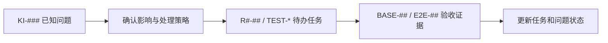

# Launchly 文档索引

> **版本**：1.0
> **生效日期**：2026-08-13
> **用途**：说明每份文档解决什么问题，并保持“规范、问题、任务、验收、环境说明”相互分离。

## 1. 阅读顺序

新成员或审核者按以下顺序阅读：

1. [产品设计规范](./产品设计规范.md)：Launchly 是什么、服务谁、做什么和不做什么。
2. [技术架构规范](./技术架构规范.md)：系统边界、进程、数据、安全和运行约束。
3. [UI 与交互规范](./UI与交互规范.md)：信息架构、页面和操作语义。
4. [交付验收规范](./交付验收规范.md)：什么证据才能证明完成。
5. [已知问题清单](./已知问题清单.md)：当前已确认的缺陷、风险和验证缺口。
6. [项目重启路线图](./项目重启路线图.md)：决定何时处理、任务依赖和阶段状态。
7. [测试补全任务书](./测试补全任务书.md)：只针对测试工程的可委派工作包。

## 2. 文档分类

### 2.1 长期规范

| 文档 | 唯一职责 | 不负责 |
| --- | --- | --- |
| [产品设计规范](./产品设计规范.md) | 定位、用户、领域模型、范围、优先级 | 当前缺陷和完成进度 |
| [技术架构规范](./技术架构规范.md) | 目标拓扑、数据、安全和技术不变量 | 逐项任务排期 |
| [UI 与交互规范](./UI与交互规范.md) | 页面结构、状态、交互和视觉系统 | 声称页面已经实现 |
| [交付验收规范](./交付验收规范.md) | 证据等级、BASE/E2E、阶段退出 | 记录未经验证的完成声明 |

### 2.2 项目治理

| 文档 | 唯一职责 | 标识 |
| --- | --- | --- |
| [已知问题清单](./已知问题清单.md) | 集中记录事实、证据、影响和状态 | `KI-###` |
| [项目重启路线图](./项目重启路线图.md) | 任务、依赖、优先级和实施进度 | `R0-##` 至 `R6-##` |
| [测试补全任务书](./测试补全任务书.md) | 可独立执行和复核的测试工作包 | `TEST-*` |

### 2.3 环境说明

| 文档 | 当前性质 |
| --- | --- |
| [NAS 部署兼容性](./NAS%20部署兼容性.md) | R1 兼容性目标，不是当前安装承诺 |
| [极空间 Z4 Pro 计划稿](./极空间Z4Pro从GitHub部署Launchly.md) | 暂停执行；R0/R1 通过后才能升级为 Runbook |

## 3. 概念与编号不可混用

- **问题不是待办**：`KI-###` 只描述已经发现的事实；一个问题可以暂不排期。
- **待办不是问题**：一个 `R#-##` 可以解决多个问题，也可以实现没有缺陷的新能力。
- **测试任务不是完成证据**：新增测试代码后仍要运行、审查有效性，并满足对应 BASE/E2E。
- **报告不是状态来源**：AI 报告、代码数量和“全部阅读”声明都不能修改进度。
- **只有验收可以关闭**：修复提交存在时标记“待验收”，证据通过后才标记“已关闭/已验收”。

## 4. 命名规则

| 前缀 | 示例 | 含义 |
| --- | --- | --- |
| `KI-` | `KI-003` | 已知问题（Known Issue） |
| `R0-`…`R6-` | `R0-04` | 路线图实施任务 |
| `TEST-` | `TEST-API-02` | 测试补全工作包 |
| `BASE-` | `BASE-06` | R0 基线验收用例 |
| `E2E-` | `E2E-18` | 真实环境端到端验收用例 |

编号一经引用不重排。删除事项时保留编号并标记取消/关闭，避免链接失效。

## 5. 更新责任

- 产品范围变化：先更新产品规范，再更新架构/UI/验收和路线图。
- 新发现缺陷：只进入已知问题清单；确认需要处理后再创建路线图任务。
- 测试补全：在测试任务书更新基线和工作包状态，不直接宣称功能可用。
- 阶段状态：只在路线图更新，并链接验收记录。
- 过程性审核、迁移指南和一次性修复提示词不进入 `docs/basic`；有价值的事实拆入上述权威文档后删除原过程文件。

## 修订记录

| 版本 | 日期 | 说明 |
| --- | --- | --- |
| 1.0 | 2026-08-13 | 建立规范、问题、任务、验收和环境说明的统一索引与编号规则 |
