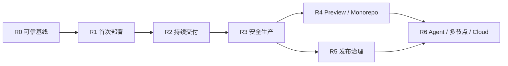

# Launchly 项目重启路线图

> **版本**：1.3
> **基线**：`873bbd6`（2026-08-13）
> **地位**：公开、可追踪的实施与进度权威。产品范围见[产品设计规范](./产品设计规范.md)，工程约束见[技术架构规范](./技术架构规范.md)，阶段退出以[交付验收规范](./交付验收规范.md)为准。
> **原则**：路线图状态只由可复跑证据改变；代码、页面、报告或 AI 自述不能单独关闭任务。

## 1. 重启目标

Launchly 从长期搁置和多轮方向变更中恢复时，不继续堆页面和功能，而按依赖关系完成三件事：

1. 建立可信、可启动、权限隔离的工程基线。
2. 打通“首次部署 → 自动交付 → 安全生产”的最小真实闭环。
3. 在闭环之上增加 Preview、发布证据、轻量观测和多节点能力。

目标产品是中文优先的 BYOS 发布控制面，不是通用 CI 平台、Kubernetes 控制台或完整项目管理工具。

## 2. 状态规则

| 状态 | 含义 |
| --- | --- |
| 待复核 | 旧代码/文档声称存在，尚未独立验证 |
| 待实施 | 已确认需求和依赖，尚无可执行实现 |
| 进行中 | 有明确负责人和当前变更，但未达到验收 |
| 代码路径 | 已有实现并通过局部自动化检查 |
| 未验收 | 代码路径存在，缺少阶段要求的真实环境证据 |
| 已验收 | 对应验收 ID 在指定 commit 有可复跑记录 |
| 阻塞 | 已确认外部条件或前置任务阻止继续 |

“完成”一词只用于“已验收”。

## 3. 当前基线快照

| 领域 | 当前事实 | 状态 |
| --- | --- | --- |
| 仓库 | monorepo，Vue/NestJS/Prisma/CLI，工作区基线 `873bbd6` | 代码路径 |
| 自动化检查 | API 82、Web 22、CLI 15 个现有单测通过；三端编译通过；TEST-API-01 已验收，但 API/Web/CLI 行覆盖率仍仅 15.39%/5.65%/10.13% | 进行中 |
| 生产启动 | 构建输出与 `dist/main` 入口不一致；Environment DI 阻断启动 | 阻塞 |
| Docker 镜像 | Dockerfile Web/BuildKit 阶段结构错误，未有真实成功镜像记录 | 阻塞 |
| 数据库 | schema 与 migrations 存在；空库、升级库未形成可复跑验收 | 未验收 |
| 权限 | Project 主接口有局部 AccessService；多个子资源存在授权缺口 | 阻塞 |
| GitHub/Webhook | 验签、去重、CI 查询有代码路径；真实 App/仓库未联调 | 未验收 |
| Worker | 租约、阶段、Runner 和回滚有代码路径；崩溃/重试未验证 | 未验收 |
| OCI/BuildKit | digest/Runner 有代码路径；Registry 凭据、真实构建推送未闭环 | 未验收 |
| BYOS | SSH/Compose/HTTP 路由有代码路径；真实节点与隔离未验收 | 未验收 |
| HTTPS/Preview/Agent | 没有完整执行路径 | 待实施 |
| 发布治理 | Test/Issue/Release 页面与服务存在；未与真实部署证据闭环 | 待复核 |

### 3.1 问题、任务和验收关系

- 已确认事实统一记录在[已知问题清单](./已知问题清单.md)，使用 `KI-###`。
- 本路线图只记录获准实施的待办，使用 `R#-##`；问题存在不代表任务已开始。
- 测试工作拆分在[测试补全任务书](./测试补全任务书.md)，使用 `TEST-*`。
- 任务完成必须链接[交付验收规范](./交付验收规范.md)中的 `BASE-##`/`E2E-##` 证据。

## 4. 阶段总览

R0–R3 是产品成立的前提。R4/R5 可在 R3 后并行设计，但不能以新页面替代 R3 的真实可靠性。

## 5. R0：可信工程基线

**目标**：仓库能构建、生产能启动、权限边界成立、迁移可复跑，形成后续所有工作的可信起点。

| ID | 任务 | 优先级 | 依赖 | 验收 |
| --- | --- | --- | --- | --- |
| R0-01 | 修正 Nest 构建输出、`start:prod`、Docker entrypoint 的统一入口 | P0 | 无 | BASE-01/02 |
| R0-02 | 修正 Dockerfile 阶段，真实构建并启动 API + Web 镜像 | P0 | R0-01 | BASE-02 |
| R0-03 | 注册 EnvironmentService，并增加应用启动烟雾测试 | P0 | 无 | BASE-03 |
| R0-04 | 建立统一 ProjectResourceAccessPolicy，覆盖 Environment/Variable/Test/Issue/Release/Target/Deployment | P0 | 无 | BASE-06/07 |
| R0-05 | 所有写接口改用 DTO/schema，并校验父子资源真实归属 | P0 | R0-04 | BASE-08 |
| R0-06 | 空库和上一基线升级库 migration CI；验证失败启动门 | P0 | R0-02 | BASE-04/05 |
| R0-07 | 统一 CLI 内嵌模板与 `deploy/compose` 的权威来源和版本 | P1 | R0-02 | BASE-10 |
| R0-08 | 核验密钥默认值、临时文件、日志/任务/审计脱敏和轮换边界 | P0 | R0-03 | BASE-09 |
| R0-09 | 修复通知前后端契约、Gate 字段和明显页面死操作 | P1 | R0-03 | 集成测试 |
| R0-10 | 固化全仓 build/test/start/check 命令和证据模板 | P1 | R0-01–09 | BASE-01/10 |
| R0-11 | 建立全量覆盖率口径并分批补齐 API/Web/CLI 测试保护网 | P0 | TEST-000 起 | BASE-11 |

R0-11 当前状态为**进行中**：TEST-000 和 TEST-API-01 已分别在 `6220fb6`、`873bbd6` 完成并经 Codex 独立复核；下一工作包是 TEST-API-02。局部单元测试通过不等于 BASE-11 通过。

**退出条件**：BASE-01 至 BASE-11 全部通过。R0 期间不开发 Preview、Cloud、AI 或新模板。

## 6. R1：首个真实 BYOS 部署

**目标**：用户在空白 Self-Host 环境完成安装，并把已有 OCI digest 发布到一台真实节点。

| ID | 任务 | 优先级 | 依赖 | 验收 |
| --- | --- | --- | --- | --- |
| R1-01 | 空白 Ubuntu 一键安装、迁移、`/setup`、API/Worker 健康 | P0 | R0 | E2E-01 |
| R1-02 | 节点验证扩展为 Docker/Compose/架构/目录/磁盘/端口/Registry 诊断 | P0 | R0-08 | E2E-02 |
| R1-03 | 已有 OCI `@sha256` → SSH 节点 → 隔离 Compose → 健康 → URL | P0 | R1-01/02 | E2E-03 |
| R1-04 | 节点和应用运行状态进入指挥中心 | P1 | R1-03 | E2E-25 局部 |
| R1-05 | CLI doctor/status/logs/backup/restore/upgrade 真实演练 | P1 | R1-01 | E2E-04 |
| R1-06 | 完成首次部署五步向导和失败保留草稿 | P1 | R1-02/03 | UI 验收 |

**退出条件**：E2E-01 至 E2E-04 通过；才能邀请个人开发者进行受控 Alpha。

## 7. R2：Git 驱动的持续交付

**目标**：真实 GitHub Push/PR 经过 CI 和策略后自动产生部署，不再依赖手动触发。

| ID | 任务 | 优先级 | 依赖 | 验收 |
| --- | --- | --- | --- | --- |
| R2-01 | GitHub App 安装、repository ID 映射、Token 生命周期 | P0 | R0-08 | E2E-05 |
| R2-02 | Webhook schema/HMAC/delivery 去重和真实事件记录 | P0 | R2-01 | E2E-05/06 |
| R2-03 | CI Checks 阻断与 GitHub 状态回写 | P0 | R2-01/02 | E2E-07 |
| R2-04 | 分支、路径、跳过和 `queue_all/latest_only/cancel_previous` | P0 | R2-02 | E2E-08/09 |
| R2-05 | 仓库检测器和可确认的 Build Plan 预览 | P1 | R2-01 | UI + 集成测试 |
| R2-06 | 最小 `launchly.yaml` schema、校验和计划版本化 | P1 | R2-05 | 集成测试 |
| R2-07 | 指挥中心真实待办、全局搜索和命令面板 | P1 | R2-02/03 | UI 验收 |

**退出条件**：E2E-05 至 E2E-09 通过。

## 8. R3：不可变制品与安全生产

**目标**：构建一次，逐级晋级；候选验证后切流，失败保持或恢复旧版本。

| ID | 任务 | 优先级 | 依赖 | 验收 |
| --- | --- | --- | --- | --- |
| R3-01 | 受限 Build Worker + BuildKit + Registry 凭据 | P0 | R2-05/06 | E2E-10 |
| R3-02 | Artifact/BuildPlanRevision/ConfigRevision 不变量和差异 API | P0 | R3-01 | E2E-10/11 |
| R3-03 | 环境泳道与同 digest 晋级 | P0 | R3-02 | E2E-10 |
| R3-04 | Release Phase、readiness、候选实例和原子路由切换 | P0 | R3-02 | E2E-12/17 |
| R3-05 | ACME HTTPS、续期、代理恢复和证书告警 | P0 | R3-04 | E2E-16 |
| R3-06 | 真实快照回滚和 rollback failure 状态 | P0 | R3-04 | E2E-18 |
| R3-07 | Worker 崩溃、超时、重试和重复副作用演练 | P0 | R3-01/04 | E2E-19 |
| R3-08 | 多应用同机隔离和节点故障处理 | P0 | R3-04 | E2E-15/20 |
| R3-09 | 部署工作台：阶段、日志、Gate、Diff、流量、回滚 | P1 | R3-02/04/06 | UI 验收 |

**退出条件**：E2E-10 至 E2E-20 通过；才可以讨论 Beta/生产可用声明。

## 9. R4：Preview 与 Monorepo

| ID | 任务 | 优先级 | 依赖 | 验收 |
| --- | --- | --- | --- | --- |
| R4-01 | PR Preview 模型、动态 URL 和隔离配置 | P1 | R3 | E2E-21 |
| R4-02 | PR 更新、并发上限、标签和路径过滤 | P1 | R4-01 | E2E-22/09 |
| R4-03 | PR 关闭/TTL 自动回收与失败待办 | P0 | R4-01 | E2E-23 |
| R4-04 | 外部 fork、密钥和网络隔离策略 | P0 | R4-01 | E2E-24 |
| R4-05 | Preview 列表、到期提示和手动清理体验 | P1 | R4-02/03 | UI 验收 |

## 10. R5：发布治理与轻量观测

| ID | 任务 | 优先级 | 依赖 | 验收 |
| --- | --- | --- | --- | --- |
| R5-01 | CI/Test/Scan/Approval/Deployment 聚合为 Release Evidence | P0 | R3 | E2E-14 |
| R5-02 | Issue 收敛为发布阻断项/部署事故，并支持外部 Issue 链接 | P1 | R5-01 | 真实发布用例 |
| R5-03 | 禁止自审、冻结窗口、豁免和审计 | P0 | R5-01 | E2E-13 |
| R5-04 | 站内 + Webhook/邮件 + 飞书/钉钉/企微通知 Outbox | P1 | R5-01 | E2E-26 |
| R5-05 | Node/容器健康、重启、CPU/内存/磁盘轻量观测 | P1 | R1-04/R3 | E2E-25/28 |
| R5-06 | 中文错误分类、诊断和恢复主路径 | P0 | R3/R5-01 | E2E-27 |

## 11. R6：Agent、多节点与未来 Cloud

先实现 Agent 出站连接、节点身份、短期任务授权、心跳、容量、排空和升级；随后验证多节点调度。只有 Self-Host R0–R5 稳定并有真实用户证据后，才重新评估 Cloud 多租户、配额和计费。

Cloud、AI 风险分析、Canary 和模板市场需要单独 PRD 与验收，不自动进入当前范围。

## 12. 暂不实施

- 通用 CI DSL、任意 Job 和插件市场。
- Kubernetes 和集群控制台。
- 浏览器宿主终端。
- 完整通用 Issue Tracker。
- 大规模数据库/应用模板市场。
- Cloud 注册、计费和多租户。
- 在基础结构化诊断前引入 AI 自动归因。

## 13. 工程与协作门禁

每个任务必须满足：

1. 任务只覆盖一个可验收目标，声明允许修改的文件和禁止范围。
2. 实现提交包含 Git diff、测试命令、原始结果和未覆盖边界。
3. 安全、migration、权限、部署状态机和生产配置必须独立复核。
4. 自动生成代码不得自行修改进度；复核人依据验收证据更新本路线图。
5. 工作区状态变化、commit 和外部部署必须获得明确授权。

## 14. 下一批工作

当前只启动 R0，建议顺序：

1. R0-01/R0-03：先恢复可启动入口。
2. R0-02：真实构建生产镜像。
3. R0-04/R0-05：封堵跨 Workspace/Project 访问。
4. R0-06：建立空库和升级库门禁。
5. R0-08：完成密钥与日志专项复核。
6. R0-07/R0-09/R0-10：统一交付配置、修契约、形成基线证据。
7. R0-11：TEST-000、TEST-API-01 已验收；从 TEST-API-02 开始按顺序补齐测试代码，每批独立复核。

R0 完成前，产品设计和原型可以继续讨论，但不并行实现 R2–R6 功能。

## 修订记录

| 版本 | 日期 | 说明 |
| --- | --- | --- |
| 1.3 | 2026-08-13 | TEST-API-01 验收，更新 API 测试与覆盖率基线，下一工作包为 TEST-API-02 |
| 1.2 | 2026-08-13 | TEST-000 验收，R0-11 转为进行中并将下一测试工作包明确为 TEST-API-01 |
| 1.1 | 2026-08-13 | 分离 KI 问题、R 路线图任务、TEST 工作包和 BASE/E2E 证据；增加 R0-11 测试保护网 |
| 1.0 | 2026-08-13 | 以 `6eef007` 建立项目重启基线，定义 R0–R6、依赖、验收映射、暂停范围和下一批工作 |
