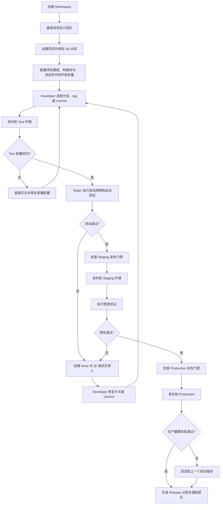
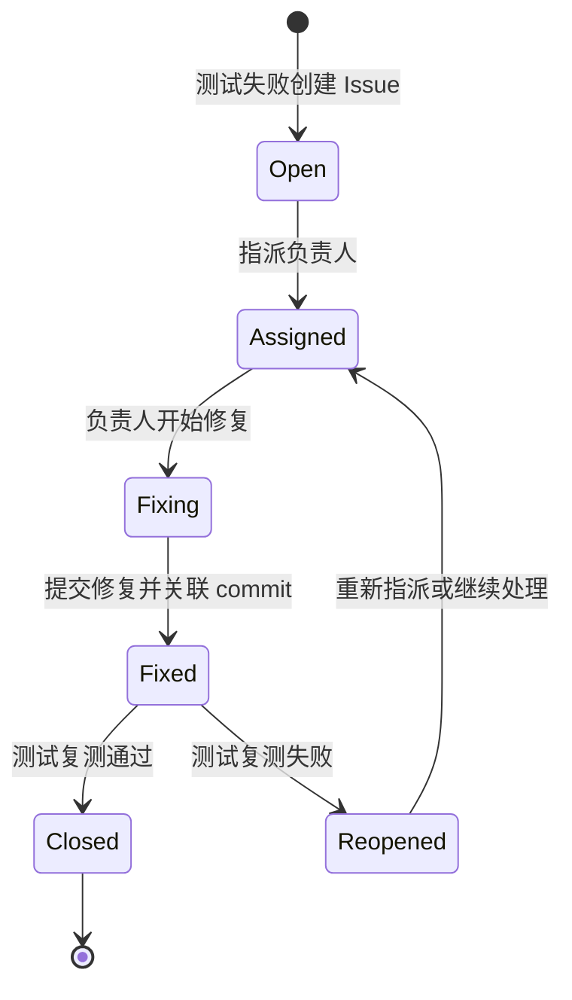
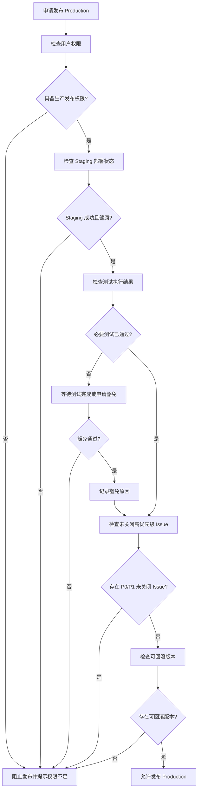
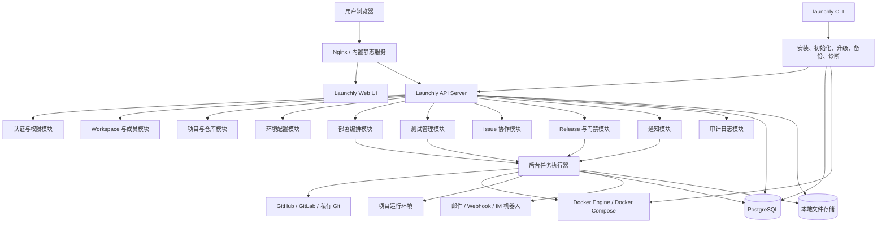
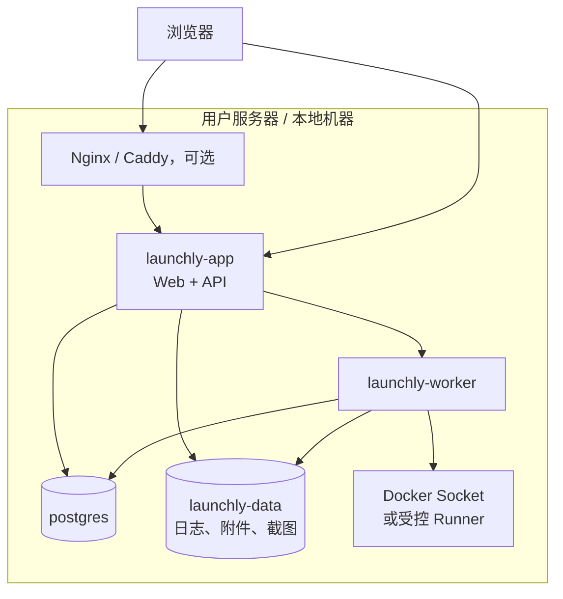
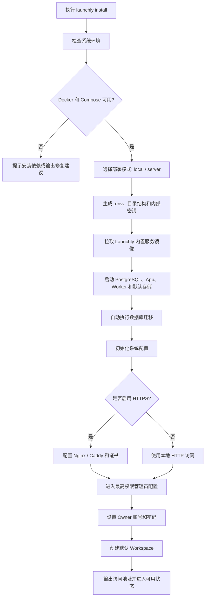
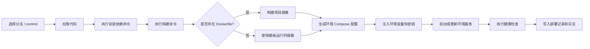

# Launchly 产品需求文档（PRD）

## 1. 项目概述

### 1.1 产品名称

Launchly

### 1.2 产品定位

Launchly 是一个面向 5-20 人小团队及个人开发者的**轻量代码自动部署平台**，提供**双模式同源**交付：

- **Launchly Cloud**：官方部署的 SaaS，账号注册即用，适合不想自己维护服务器的团队。
- **Launchly Self-Host**：开源版，用户在自己的服务器上通过 CLI 一键部署，完全掌控数据和运行环境。

核心链路是"接入仓库 → 构建 → 部署 → 健康检查 → 回滚"。测试集成（L0 + L1）、Issue 跟踪、Release 门禁、审计日志和通知作为基础功能直接包含，AI 报告、第三方通知绑定、安全监控作为付费增值。

### 1.3 部署形态

Launchly 以两种形态交付：

- **Cloud**：官方部署在 launchly 域名下，用户注册即用，无需关心服务器运维。适合不想自己维护基础设施的团队。
- **Self-Host**：用户通过 `launchly` CLI 一键部署到自己的服务器（本地、NAS、内网、私有云或公网 VPS）。适合对数据主权有要求、或有自建运维能力的团队。

无论哪种形态，Launchly 管理的项目都部署到用户自带的 BYOS（Bring Your Own Server）目标上。MVP 阶段不提供 Launchly 托管运行时。

Self-Host 形态下，CLI 负责：检查环境、启动内置 PostgreSQL/App/Worker、执行数据库迁移、初始化管理员账号。用户不需要自己安装或配置数据库、队列、对象存储等中间件。

### 1.4 核心价值

- **开发人员**：绑定仓库 → 点击发布 → 等待构建部署完成。不用手动 SSH 上去敲 `git pull && docker build && docker run`。
- **团队负责人**：统一管理部署目标（服务器）、成员权限、环境变量和发布门禁。每次发布谁、什么版本、部署到哪、是否成功，全程可追踪。
- **小团队**：一个轻量工具覆盖"代码 → 构建 → 部署 → 健康检查 → 回滚"全链路，内置测试集成、Issue 跟踪和 Release 记录作为基础功能。

### 1.5 产品边界

Launchly 聚焦”代码自动部署”主线，**不做**代码托管、复杂 CI/CD 编排、企业级 ITSM。

第一阶段重点：

- Organization（组织）与成员管理
- 项目与 Git 仓库绑定（通过 PAT 拉取）
- 三档角色（Owner / Member / Viewer）
- 部署目标管理（BYOS SSH / Docker context）
- 手动触发部署（点击发布）
- 构建 + 部署 + 健康检查 + 回滚
- L0 + L1 测试集成
- Issue 协作（分配、修复、复测）——作为基础功能
- Release 门禁（L1 顺序门禁）——作为基础功能
- 通知中心与审计日志——作为基础功能
- Self-Host CLI 一键部署与运维

---

## 2. 用户与组织模型

### 2.1 Organization 模型

Launchly 采用 `Organization -> Project -> Component -> Environment` 的组织模型。

```text
Launchly Instance (Cloud or Self-Host)
  └── Organization
        ├── Members (Owner / Member / Viewer)
        ├── Projects
        │     ├── Components (发布单元)
        │     │     ├── Repository Binding (仓库 + rootDir)
        │     │     ├── Build Command / Start Command / Port
        │     │     └── Deploy Targets (部署目标)
        │     ├── Environments (按 order 排序)
        │     ├── Deployments (部署记录)
        │     ├── Test Cases / Test Runs
        │     ├── Issues
        │     └── Releases
        └── Settings
```

Organization 是团队协作的最上层空间，对应旧版设计中的 "Workspace"。一个实例可以有多个 Organization（Cloud 版按注册自动创建；Self-Host 版安装时创建默认 Organization）。

### 2.2 用户角色

Launchly 角色精简为三档：

| 角色 | 定位 | 核心能力 |
| --- | --- | --- |
| Owner | Organization 拥有者 | 管理 Organization、成员、项目、部署目标、权限、所有发布操作 |
| Member | 普通成员 | 创建项目、绑定仓库、管理部署目标、触发部署、查看日志、管理测试用例和 Issue |
| Viewer | 只读成员 | 查看项目、环境、部署记录、测试结果和 Issue |

不按职位（前端/后端/测试）建模角色。细粒度的 Component 级权限（人 × Component × 操作）作为远期 Pro 功能。

### 2.3 邀请加入机制

Launchly 优先采用邀请加入，而不是要求每个成员主动注册后再申请加入。

推荐流程：

```text
Owner 创建邀请
  -> 选择 Organization 和角色
  -> 生成邀请链接
  -> 成员打开链接
  -> 设置昵称/密码或绑定第三方账号
  -> 自动加入 Organization
```

邀请链接应支持：

- 设置默认角色
- 设置有效期
- 设置可使用次数
- 手动撤销
- 记录邀请人和加入时间

### 2.4 账号登录方式

第一阶段建议支持：

- 邮箱 + 密码
- 邀请链接快速加入
- GitHub OAuth
- GitLab OAuth 或私有 GitLab OAuth 配置

后续可扩展：

- Google 登录
- 飞书、企业微信、钉钉登录
- LDAP / OIDC

### 2.5 Component 与发布单元

Component 是 Launchly 的核心发布单元抽象。一个 Project 可以包含多个 Component（例如一个前端应用 + 一个后端 API + 一个 admin 后台），每个 Component 独立配置构建和部署参数。

Component 数据模型：

| 字段 | 类型 | 说明 |
| --- | --- | --- |
| id | UUID | 主键 |
| organizationId | UUID | 多租户预留 |
| projectId | UUID | 所属项目 |
| name | String | 项目内唯一名称 |
| repoBindingId | UUID | 关联的仓库绑定 |
| rootDir | String | 仓库内子目录，默认 `/` |
| buildCommand | String | 构建命令 |
| startCommand | String | 启动命令 |
| port | Integer | 服务端口 |
| testCommand | String | 测试命令（W3 使用） |
| testReportPath | String | 测试报告路径（W3 使用） |
| createdAt / updatedAt | Timestamp | 自动维护 |

MVP 行为：

- 新建项目时自动创建一个名为 `default` 的 Component，继承项目的 build/start 配置。
- 项目只有一个 Component 时，UI 默认折叠 Component 层，用户感知不到 Component 的存在。
- 项目有多个 Component 时，UI 展开 Component 卡片，每个 Component 可独立部署。

Component 删除约束：项目必须至少有 1 个 Component，删除最后一个时返回 409。删除 Component 不级联删除关联的 deployment 记录（部署历史必须保留）。

---

## Edition 与双模式

Launchly 采用单仓库 + 编译时 `EDITION` 开关实现 Cloud 和 Self-Host 两种交付物。核心引擎代码（部署、测试、Issue、Release、门禁、审计）两种模式共享。

| 维度 | Cloud | Self-Host |
| --- | --- | --- |
| 部署方式 | 官方托管，浏览器打开即用 | 用户通过 CLI 一键部署 |
| 多租户 | 按注册账号隔离 Organization | 单实例一个 Organization（远期可多） |
| 计费 | Free / Pro 订阅 | 免费开源（AGPL-3.0） |
| 部署目标 | 仅 BYOS（用户自带服务器） | 仅 BYOS |
| CLI | 不提供 | 提供（install/up/down/backup/restore/doctor） |
| 代码组织 | `cloud-only/` 目录（注册、计费、多租户） | `selfhost-only/` 目录（CLI、安装器） |

两种模式通过编译时 profile 或环境变量 `LAUNCHLY_EDITION=cloud|selfhost` 切换，运行时行为由该开关控制。

---

## 3. 核心业务流程

### 3.0 总体流程图



### 3.1 项目接入流程

```text
创建项目
  -> 填写项目基础信息
  -> 绑定 GitHub / GitLab / 私有 Git 仓库
  -> 选择项目模板
  -> 配置构建命令、启动命令、健康检查
  -> 配置 Test / Staging / Production 环境变量
  -> 添加团队成员
  -> 项目进入可部署状态
```

项目接入时应尽量降低用户理解成本。Launchly 可以通过项目模板提供默认建议，例如 Node.js、Java Spring Boot、Python、Go、Dockerfile 项目和静态站点。

### 3.2 测试环境发布流程

```text
Developer 选择分支或 commit
  -> 点击发布到 Test
  -> Launchly 拉取代码
  -> 执行构建
  -> 生成部署包或镜像
  -> 部署到 Test 环境
  -> 执行健康检查
  -> 通知相关成员
```

测试环境发布成功后，测试人员可以基于当前版本创建或执行测试任务。

### 3.3 测试与问题修复流程

```text
Tester 执行测试用例
  -> 用例通过，记录 Passed
  -> 用例失败，创建 Issue
  -> @ 指派对应 Developer
  -> Developer 收到通知并修复
  -> Developer 提交代码并重新部署 Test
  -> Issue 状态更新为 Fixed
  -> Tester 收到复测通知
  -> 复测通过后关闭 Issue
  -> 复测失败则 Reopened
```

这个流程是 Launchly 区别于普通部署工具的重要能力。测试失败不应只是记录结果，而应能继续推动修复、复测和关闭。

#### 3.3.1 Issue 状态流转图



### 3.4 预发环境流程

```text
Test 环境测试通过
  -> 满足预发门禁
  -> 有权限成员点击发布到 Staging
  -> Launchly 使用 Staging 配置部署
  -> 执行健康检查和自动测试命令
  -> Tester 进行预发验证
  -> 验证通过后进入待上线状态
```

Staging 环境用于模拟真实环境，配置应尽量接近 Production，但敏感密钥、数据源和外部依赖仍应独立管理。

### 3.5 生产发布流程

```text
Staging 验证通过
  -> 检查生产发布门禁
  -> Owner/Admin 或具备权限者点击发布上线
  -> Launchly 部署 Production
  -> 执行生产健康检查
  -> 生成 Release 记录
  -> 通知团队发布结果
```

生产发布必须保留完整记录，包括发布人、发布时间、版本、commit、测试结果、关联问题、部署日志和回滚点。

### 3.6 回滚流程

```text
生产发布异常
  -> 有权限成员点击回滚
  -> 选择上一个成功版本
  -> 填写回滚原因
  -> Launchly 自动部署上一稳定版本
  -> 执行健康检查
  -> 生成回滚记录
  -> 通知团队
```

第一阶段至少支持回滚到上一个成功部署版本。

### 3.7 发布门禁流程图



---

## 4. 功能需求

### 4.1 账号与 Workspace

**FR-001 账号注册与登录**

- 支持邮箱密码登录。
- 支持通过邀请链接加入 Workspace。
- 支持 GitHub OAuth 登录。
- 支持配置私有 GitLab OAuth。

**FR-002 Workspace 管理**

- 创建 Workspace。
- 修改 Workspace 名称、头像、描述。
- 查看 Workspace 成员列表。
- 管理成员角色。
- 移除成员。

**FR-003 邀请管理**

- 创建邀请链接。
- 设置邀请角色、有效期、使用次数。
- 复制邀请链接。
- 撤销邀请链接。
- 查看邀请状态。

### 4.2 项目管理

**FR-004 创建项目**

- 填写项目名称、描述、项目类型。
- 选择项目模板。
- 绑定 GitHub、GitLab 或私有 Git 仓库。
- 配置默认分支。
- 配置构建命令、启动命令、测试命令。
- 配置健康检查路径。

**FR-005 仓库绑定**

- 支持 GitHub 仓库。
- 支持 GitLab 仓库。
- 支持私有 Git 仓库地址和访问凭据。
- 支持按分支、tag、commit 选择发布版本。

**FR-006 项目成员**

- 项目可继承 Workspace 成员。
- 项目内可覆盖成员角色。
- 支持查看成员在项目内的权限。

### 4.3 环境管理

**FR-007 默认环境**

每个项目默认包含三个环境：

- `Test`：测试环境
- `Staging`：预发环境
- `Production`：生产环境

**FR-008 环境配置**

- 每个环境独立配置环境变量。
- 敏感变量加密存储并默认脱敏展示。
- 每个环境可配置域名、端口、资源限制和健康检查。
- 支持启用或禁用某个环境。

**FR-009 环境状态**

- 展示当前版本。
- 展示当前 commit。
- 展示最近部署人和部署时间。
- 展示健康检查状态。
- 展示访问地址。
- 展示运行日志入口。

### 4.4 部署管理

**FR-010 触发部署**

- 有权限成员可以选择分支、tag 或 commit 触发部署。
- 支持部署到 Test、Staging、Production。
- 不同环境的部署权限独立控制。

**FR-011 构建与部署日志**

- 展示拉取代码、安装依赖、构建、部署、健康检查全过程日志。
- 支持实时刷新。
- 支持按阶段查看。
- 支持失败原因展示。

**FR-012 部署记录**

每次部署记录应包含：

- 项目
- 环境
- 分支、tag 或 commit
- 部署人
- 部署状态
- 开始时间和结束时间
- 构建日志
- 部署日志
- 健康检查结果
- 失败原因

**FR-013 回滚**

- Production 至少支持回滚到上一个成功部署版本。
- 回滚需要权限控制。
- 回滚时必须填写原因。
- 回滚操作写入审计日志。

### 4.5 测试用例与测试执行

**FR-014 测试用例管理**

- 在项目下创建测试用例。
- 测试用例包含标题、步骤、预期结果、优先级、标签、维护人。
- 支持启用、禁用、编辑和删除测试用例。
- 支持按模块、标签、优先级筛选。

**FR-015 测试任务**

- 每次发布可生成测试任务。
- 测试任务关联环境、版本和测试用例集合。
- 测试人员可执行测试并记录结果。

**FR-016 测试结果**

测试用例执行结果包括：

- `Passed`：通过
- `Failed`：失败
- `Blocked`：阻塞
- `Skipped`：跳过

测试结果可附加：

- 备注
- 截图
- 日志
- 关联 Issue

**FR-017 自动测试命令**

- 项目可配置自动测试命令，例如 `npm test`、`pytest`、`mvn test`、`go test ./...`。
- 发布后可手动或自动触发测试命令。
- 自动测试结果应进入当前版本的测试记录。

### 4.6 Issue 与修复复测

**FR-018 创建 Issue**

测试失败时，测试人员可以创建 Issue，并关联：

- 项目
- 环境
- 发布版本
- 测试用例
- 截图、日志和备注

**FR-019 指派负责人**

- Issue 可以 `@` 指派给具体成员。
- 支持设置优先级。
- 支持设置截止时间。
- 被指派成员应收到通知。

**FR-020 Issue 状态流转**

Issue 状态包括：

- `Open`：待处理
- `Assigned`：已指派
- `Fixing`：修复中
- `Fixed`：已修复，待复测
- `Reopened`：复测失败，重新打开
- `Closed`：已关闭

**FR-021 修复与复测**

- Developer 修复后可关联 commit。
- Developer 可将 Issue 状态更新为 Fixed。
- Tester 收到复测通知。
- Tester 复测通过后关闭 Issue。
- 复测失败后状态回到 Reopened。

### 4.7 Release 与发布门禁

**FR-022 Release 记录**

每次进入 Staging 或 Production 的版本都应形成 Release 记录。

Release 包含：

- 版本号
- 项目
- 环境
- 分支、tag 或 commit
- 发布说明
- 发布人
- 发布时间
- 测试结果
- 关联 Issue
- 部署日志
- 回滚点

**FR-023 发布门禁**

Production 发布前应检查门禁条件。

第一阶段建议门禁包括：

- Staging 环境部署成功。
- Staging 健康检查通过。
- 必要测试用例已执行。
- 无未关闭的 P0/P1 Issue。
- 自动测试命令通过，或被有权限成员手动豁免。
- 存在可回滚版本。
- 当前用户具备生产发布权限。

**FR-024 门禁豁免**

- 有权限成员可以对某些门禁做手动豁免。
- 豁免必须填写原因。
- 豁免记录写入 Release 和审计日志。

### 4.8 通知中心

**FR-025 站内通知**

系统内应提供通知中心，记录：

- 邀请加入
- 部署成功或失败
- 测试任务分配
- Issue 指派
- Issue 状态变化
- 复测提醒
- 发布上线结果
- 回滚结果

**FR-026 邮件通知**

第一阶段建议支持邮件通知，用于：

- 邀请成员
- Issue 指派
- 部署失败
- 生产发布结果

**FR-027 Webhook 通知**

支持配置 Webhook，用于接入：

- 飞书机器人
- 企业微信机器人
- 钉钉机器人
- Slack
- 自定义 HTTP 接收端

移动端实时通知可优先通过飞书、企业微信、钉钉等 IM Webhook 实现，暂不要求第一阶段开发原生移动端 App。

### 4.9 权限与审计

**FR-028 角色权限**

权限点至少覆盖：

- 创建项目
- 修改项目配置
- 绑定仓库
- 管理项目成员
- 部署 Test
- 部署 Staging
- 部署 Production
- 回滚 Production
- 管理测试用例
- 创建和指派 Issue
- 关闭 Issue
- 管理环境变量
- 管理邀请链接

**FR-029 审计日志**

需要记录关键操作：

- 登录
- 创建或删除项目
- 修改环境变量
- 触发部署
- 发布 Production
- 回滚
- 创建邀请
- 修改成员角色
- 门禁豁免
- 删除或关闭关键记录

---

## 5. 信息架构与页面规划

### 5.1 产品风格

Launchly 的界面应清晰、准确、克制，不需要花哨视觉。页面应接近 GitLab、Linear、Jira、Sentry 这类工作台产品：信息密度适中，模块边界清楚，状态表达准确。

设计原则：

- 左侧主导航清晰。
- 顶部明确当前 Workspace 和 Project。
- 页面标题直接说明当前模块。
- 以表格、状态标签、详情面板、日志窗口为主。
- 避免营销式大图、装饰卡片和过度动画。
- 所有关键状态必须可追踪、可解释。

### 5.2 主导航

```text
Dashboard       总览
Projects        项目
Deployments     部署记录
Environments    环境
Tests           测试
Issues          问题
Releases        发布
Members         成员
Settings        设置
```

### 5.3 核心页面

**Dashboard**

- 当前 Workspace 项目数量。
- 最近部署状态。
- 待处理 Issue。
- 待复测 Issue。
- 最近生产发布。
- 部署失败提醒。

**Projects**

- 项目列表。
- 项目创建入口。
- 项目详情。
- 仓库绑定状态。
- 最近部署环境。

**Project Detail**

- 项目基础信息。
- 仓库信息。
- 当前 Test / Staging / Production 版本。
- 快速部署入口。
- 最近测试结果。
- 最近 Issue。

**Environments**

- 三个环境状态。
- 当前版本和访问地址。
- 环境变量入口。
- 健康检查状态。
- 实时日志入口。

**Deployments**

- 部署历史。
- 部署详情。
- 构建日志。
- 部署日志。
- 失败原因。

**Tests**

- 测试用例列表。
- 测试任务列表。
- 测试执行详情。
- 自动测试命令结果。

**Issues**

- Issue 列表。
- 按负责人、状态、优先级筛选。
- Issue 详情。
- 指派、状态流转、评论、复测记录。

**Releases**

- Release 列表。
- 发布详情。
- 发布门禁状态。
- 关联测试结果。
- 关联 Issue。
- 回滚入口。

**Members**

- 成员列表。
- 角色管理。
- 邀请链接管理。

**Settings**

- Workspace 设置。
- 项目模板。
- Git 集成。
- 邮件设置。
- Webhook 设置。
- 权限策略。

---

## 6. 架构设计与技术方案

### 6.1 技术选型原则

Launchly 面向自托管和小团队，技术选型应优先考虑：

- 部署简单
- 依赖少
- 可维护
- 本地运行稳定
- 后续可扩展

不建议第一阶段堆叠过多中间件。

### 6.2 总体架构

Launchly 第一阶段建议采用“模块化单体 + 后台任务执行器”的架构。这样可以降低自托管部署复杂度，同时保留后续拆分服务的空间。



核心设计判断：

- Web UI 和 API Server 可以作为一个产品包交付。
- API Server 负责业务规则、权限校验、数据读写和任务调度。
- 后台任务执行器负责耗时任务，例如拉代码、构建、部署、测试命令、通知发送。
- PostgreSQL 作为第一阶段唯一强依赖数据库。
- 日志、截图、附件先存本地文件系统，后续兼容 S3 / MinIO。
- Docker / Docker Compose 作为第一阶段主要部署执行目标。
- `launchly` CLI 作为实例生命周期管理入口，降低本地部署和公网部署的安装门槛。

### 6.3 模块架构

```text
launchly
  ├── web                         # 前端应用
  ├── api                         # 后端 API 与业务模块
  │   ├── auth                    # 登录、邀请、OAuth、Token
  │   ├── workspace               # Workspace、成员、角色
  │   ├── project                 # 项目、仓库、模板
  │   ├── environment             # 环境变量、环境状态
  │   ├── deployment              # 部署记录、构建日志、回滚
  │   ├── test                    # 测试用例、测试任务、测试结果
  │   ├── issue                   # 问题指派、状态流转、复测
  │   ├── release                 # Release、发布门禁、豁免
  │   ├── notification            # 站内通知、邮件、Webhook
  │   └── audit                   # 审计日志
  ├── worker                      # 后台任务执行器
  ├── runner                      # 项目构建、测试、部署执行封装
  ├── cli                         # 一键部署、升级、备份、诊断命令行工具
  └── deploy                      # Launchly 自身部署配置
```

模块边界说明：

| 模块 | 职责 |
| --- | --- |
| Auth | 用户登录、OAuth、邀请链接、访问令牌 |
| Workspace | 团队空间、成员、角色、项目归属 |
| Project | 项目资料、仓库绑定、项目模板、构建配置 |
| Environment | Test / Staging / Production 环境配置和环境变量 |
| Deployment | 构建、部署、日志、状态、回滚 |
| Test | 测试用例、测试任务、自动测试命令结果 |
| Issue | 测试失败后的问题分派、修复、复测、关闭 |
| Release | 发布记录、发布门禁、门禁豁免、上线结果 |
| Notification | 站内通知、邮件通知、Webhook 通知 |
| Audit | 关键操作审计和追踪 |
| Worker | 异步执行耗时任务，避免 API 请求阻塞 |
| Runner | 封装 Git、Docker、Shell 命令执行，隔离执行细节 |
| CLI | 管理 Launchly 实例安装、初始化、启动、停止、升级、备份和诊断 |

### 6.4 部署架构

#### 6.4.1 Launchly 自身部署

第一阶段推荐使用 Docker Compose 交付 Launchly 自身。



部署包应包含：

- `docker-compose.yml`
- `.env.example`
- 初始化脚本
- 数据库迁移脚本
- 管理员初始化入口
- 默认本地文件存储目录

#### 6.4.2 命令行一键部署

Launchly 最终应提供 `launchly` CLI 作为自托管实例的统一管理入口。Docker Compose 是底层交付方式，CLI 是用户直接接触的安装和运维体验。

一键部署必须遵循以下原则：

- 用户不需要单独下载、安装或配置 PostgreSQL。
- 用户不需要单独准备队列、缓存或对象存储。
- 用户不需要手写 `docker-compose.yml`、`.env` 或数据库初始化脚本。
- 用户不需要手动执行数据库建表或迁移。
- 用户不需要理解内部服务拆分，只需要知道访问地址和管理员账号。
- 安装完成后，Launchly 应进入可登录、可创建 Workspace、可接入项目的状态。

目标体验：

```bash
launchly install
```

或公网部署：

```bash
launchly install --domain launchly.example.com --email admin@example.com --https
```

首次安装流程：



首次安装后需要用户配置的必要信息：

| 信息 | 是否必填 | 说明 |
| --- | --- | --- |
| 最高权限管理员邮箱或用户名 | 必填 | 用于创建第一个 Owner 账号 |
| 最高权限管理员密码 | 必填 | 用户自己设置，系统不应长期保存明文 |
| 默认 Workspace 名称 | 必填，可提供默认值 | 例如 `Default Workspace` 或用户输入团队名称 |
| 访问域名 | 公网部署时建议填写 | 本地部署可使用 IP 或 localhost |
| 管理员联系邮箱 | 公网 HTTPS 或通知配置时需要 | 可用于证书申请、系统通知或找回入口 |

管理员初始化方式可以支持两种：

- **CLI 交互式初始化**：`launchly install` 最后提示输入管理员账号、密码和默认 Workspace 名称。
- **浏览器初始化向导**：安装完成后输出一次性初始化地址，用户在浏览器中完成管理员配置。

第一阶段建议优先采用浏览器初始化向导，CLI 输出一次性初始化 Token。这样可以避免在终端中处理复杂表单，也更接近普通用户的操作习惯。

推荐命令：

| 命令 | 说明 |
| --- | --- |
| `launchly install` | 一键安装并初始化 Launchly |
| `launchly up` | 启动 Launchly 实例 |
| `launchly down` | 停止 Launchly 实例 |
| `launchly restart` | 重启实例 |
| `launchly status` | 查看 App、Worker、Database 状态 |
| `launchly logs` | 查看 Launchly 自身日志 |
| `launchly upgrade` | 升级到最新版本或指定版本 |
| `launchly backup` | 备份数据库、配置、附件和日志 |
| `launchly restore` | 从备份恢复 |
| `launchly doctor` | 检查 Docker、端口、磁盘、权限、配置 |
| `launchly reset-admin` | 重置管理员账号或密码 |
| `launchly uninstall` | 卸载实例，默认保留数据并要求二次确认 |

部署模式：

| 模式 | 命令示例 | 适用场景 |
| --- | --- | --- |
| 本地模式 | `launchly install --mode local` | 单人、本机、内网测试 |
| 服务器模式 | `launchly install --mode server --domain launchly.example.com` | 公网或团队服务器 |
| 高级模式 | `launchly install --external-db --storage s3` | 后续扩展，接入外部数据库或对象存储 |

内置依赖边界：

| 类型 | 第一阶段处理方式 | 用户是否需要手工配置 |
| --- | --- | --- |
| 数据库 | 内置 PostgreSQL 容器 | 不需要 |
| 后台任务 | 内置 Worker 服务 | 不需要 |
| 文件存储 | 内置本地数据目录 | 不需要 |
| 日志存储 | 内置本地日志目录 | 不需要 |
| 数据库迁移 | 安装和升级时自动执行 | 不需要 |
| 内部密钥 | 安装时自动生成 | 不需要 |
| 反向代理 | 本地模式不需要，公网模式可自动生成配置 | 通常不需要 |
| HTTPS 证书 | 公网模式可选自动配置 | 可选 |
| 邮件 SMTP | 系统可正常运行，通知增强时再配置 | 可选 |
| IM Webhook | 系统可正常运行，通知增强时再配置 | 可选 |
| 外部对象存储 | 后续高级模式支持 | 可选 |
| 外部数据库 | 后续高级模式支持 | 可选 |

CLI 应负责：

- 检查 Docker、Docker Compose、端口、磁盘空间和系统权限。
- 生成和维护 `.env` 配置。
- 创建数据目录和日志目录。
- 拉取或更新 Launchly App、Worker、PostgreSQL 等内置服务镜像。
- 启动、停止和升级 Compose 服务。
- 执行数据库迁移。
- 生成内部密钥和服务间访问凭据。
- 创建或引导创建最高权限管理员账号。
- 创建默认 Workspace。
- 输出访问地址、初始化状态和故障修复建议。
- 提供备份、恢复、诊断能力。

CLI 不应负责：

- 替代 Launchly Web UI 做业务操作。
- 直接修改项目测试用例、Issue 或 Release 数据。
- 在未确认的情况下删除用户数据。

#### 6.4.3 被管理项目部署

Launchly 管理项目时，第一阶段优先采用 Docker / Docker Compose。



环境隔离策略：

- 每个项目环境使用独立容器名称前缀。
- 每个项目环境使用独立网络。
- 每个项目环境使用独立数据卷。
- Test、Staging、Production 环境变量分开存储。
- Production 环境操作需要更严格权限和门禁。

### 6.5 技术栈

| 层级 | 建议选型 | 说明 |
| --- | --- | --- |
| 前端 | Vue 3 + TypeScript + Vite | 现代前端开发体验 |
| UI 组件 | Ant Design Vue | 更适合后台管理、表格、表单和权限类产品 |
| 前端状态 | Pinia | 管理用户、Workspace、项目和页面状态 |
| 前端路由 | Vue Router | Workspace、Project 和功能页路由 |
| 后端 | Java Spring Boot 3.x | 适合权限、流程和后台任务 |
| 数据库 | PostgreSQL | 单库优先，降低部署复杂度 |
| ORM / 数据访问 | MyBatis Plus 或 JPA 二选一 | 以团队实现效率和可维护性为准 |
| 数据库迁移 | Flyway | 管理自托管升级时的数据库变更 |
| 权限 | Spring Security + RBAC | 支持角色权限和接口保护 |
| Token | JWT + Refresh Token | 支持 Web 登录和 API 鉴权 |
| 缓存 | Redis，可选 | 第一阶段仅在必要时使用，例如会话、限流、任务锁 |
| 队列 | PostgreSQL 任务表 | 第一阶段避免强依赖 RabbitMQ / Kafka |
| 对象存储 | 本地文件存储，后续兼容 S3/MinIO | 存储截图、日志附件 |
| 日志 | Logback + JSON 日志 | 便于后续检索和归档 |
| 部署执行 | Docker / Docker Compose | 优先适配自托管场景 |
| Git 集成 | JGit 或 Git CLI | 支持 GitHub、GitLab 和通用 Git 仓库 |
| 通知 | SMTP + Webhook | 覆盖邮件、飞书、企业微信、钉钉、Slack |
| 反向代理 | Nginx，可选 | 公网部署时使用 |
| 打包交付 | Docker Compose | 提供最简单的自托管安装方式 |
| 命令行工具 | Go 或 Node.js 单文件 CLI | 负责一键部署、升级、备份、恢复和诊断 |

第一阶段默认内置服务：

| 服务 | 说明 |
| --- | --- |
| `launchly-app` | Web UI 与 API Server |
| `launchly-worker` | 后台任务执行器 |
| `launchly-postgres` | 内置 PostgreSQL 数据库 |
| `launchly-data` | 本地数据、附件、截图、日志目录 |
| `launchly-proxy` | 可选反向代理，仅公网或 HTTPS 模式启用 |

### 6.6 后台任务与 Runner 设计

Launchly 的部署、自动测试、通知发送等任务不应在 HTTP 请求中同步执行。建议使用任务表驱动后台执行。

任务类型：

- `repo.clone`
- `repo.pull`
- `project.build`
- `project.deploy`
- `project.health_check`
- `test.run_command`
- `release.gate_check`
- `notification.send`
- `production.rollback`

任务状态：

- `Pending`
- `Running`
- `Succeeded`
- `Failed`
- `Canceled`

Runner 执行原则：

- 所有命令必须记录 stdout、stderr 和退出码。
- 每个任务必须有超时时间。
- 敏感环境变量写入日志前必须脱敏。
- 失败任务应保留上下文，方便用户排查。
- Production 相关任务必须记录审计日志。

### 6.7 部署执行策略

第一阶段优先支持 Docker / Docker Compose：

- Launchly 自身通过 Docker Compose 部署。
- 项目可以通过 Dockerfile 构建镜像。
- 项目也可以通过自定义构建命令和启动命令运行。
- 每个项目环境生成独立服务、网络和卷。

Kubernetes 支持可以作为后续高级能力，不作为 MVP 必选项。

### 6.8 安全设计

第一阶段需要覆盖以下安全要求：

- 密码使用强哈希算法存储。
- OAuth Token、Git 凭据、环境变量密钥加密存储。
- 敏感字段在 UI 和日志中默认脱敏。
- Production 部署、回滚、门禁豁免必须记录审计日志。
- Webhook Secret 支持重新生成。
- 邀请链接支持过期和撤销。
- Runner 执行命令需要限制工作目录，避免越权访问。
- 公网部署时建议通过 Nginx / Caddy 配置 HTTPS。
- CLI 执行卸载、恢复、覆盖配置等高风险操作时必须要求二次确认。
- CLI 生成的初始管理员密码只能展示一次，并提示用户首次登录后修改。

### 6.9 项目模板

建议内置模板：

- Node.js
- Java Spring Boot
- Python FastAPI / Django
- Go
- Dockerfile 项目
- 静态站点
- 自定义命令

模板提供默认字段：

- 安装依赖命令
- 构建命令
- 启动命令
- 测试命令
- 健康检查路径
- 默认端口

---

## 7. 数据模型草案

### 7.1 核心实体

```text
User
Workspace
WorkspaceMember
Invitation
Project
ProjectMember
RepositoryCredential
Environment
EnvironmentVariable
Deployment
Release
TestCase
TestRun
TestRunCase
Issue
Notification
AuditLog
Webhook
```

### 7.2 关键实体说明

**Project**

- id
- workspace_id
- name
- description
- project_type
- repository_url
- default_branch
- template_type
- build_command
- start_command
- test_command
- health_check_path
- created_by
- created_at

**Environment**

- id
- project_id
- name
- type: `test` / `staging` / `production`
- url
- status
- current_deployment_id
- health_status
- created_at

**Deployment**

- id
- project_id
- environment_id
- branch
- tag
- commit_sha
- status
- triggered_by
- started_at
- finished_at
- build_log_path
- deploy_log_path
- error_message
- rollback_from_deployment_id

**TestCase**

- id
- project_id
- title
- module
- steps
- expected_result
- priority
- tags
- owner_id
- status

**Issue**

- id
- project_id
- environment_id
- deployment_id
- test_case_id
- title
- description
- priority
- status
- reporter_id
- assignee_id
- fixed_commit_sha
- created_at
- updated_at
- closed_at

**Release**

- id
- project_id
- environment_id
- deployment_id
- version
- notes
- status
- gate_status
- released_by
- released_at
- rollback_deployment_id

---

## 8. MVP 范围

### 8.1 MVP 必须包含

- 账号登录
- Workspace
- 邀请成员
- 角色权限
- 创建项目
- 绑定 Git 仓库
- 配置构建、启动、测试命令
- Test / Staging / Production 三个环境
- 环境变量管理
- 触发部署
- 部署日志和状态
- 测试用例管理
- 测试执行记录
- Issue 创建、指派、修复、复测、关闭
- 站内通知
- 邮件通知
- Webhook 通知
- Release 记录
- 生产发布门禁
- 回滚到上一个成功版本
- 审计日志
- `launchly` CLI 一键安装
- 一键安装内置 PostgreSQL、App、Worker、默认文件存储和基础配置
- 首次初始化最高权限管理员账号
- 首次初始化默认 Workspace
- `launchly` CLI 启动、停止、状态检查和日志查看
- `launchly` CLI 数据备份和基础恢复
- `launchly doctor` 环境诊断

### 8.2 MVP 暂不包含

- 多租户计费
- 插件市场
- 原生移动端 App
- 完整代码托管
- 复杂流水线编排
- Kubernetes 多集群管理
- Jira/TestLink 深度双向同步
- 企业级 LDAP / SSO 强集成
- 复杂审批流设计器
- 高级报表系统
- 跨平台桌面安装器
- 原生移动端管理 App

### 8.3 第一阶段成功指标

| 指标 | 目标 |
| --- | --- |
| 本地部署完成时间 | 15 分钟内完成 Launchly 初始化 |
| 命令行一键安装成功率 | 标准 Docker 环境下 95% 以上 |
| 安装后可用状态 | 安装完成后无需手工配置数据库即可登录系统 |
| 项目首次接入时间 | 10 分钟内完成一个标准项目接入 |
| 测试环境平均部署时间 | 5 分钟内 |
| 部署记录完整率 | 100% |
| Issue 指派通知到达率 | 95% 以上 |
| 生产发布前门禁检查覆盖率 | 100% |
| 回滚成功率 | 95% 以上 |

---

## 9. 风险与待确认问题

### 9.1 产品风险

| 风险 | 影响 | 应对 |
| --- | --- | --- |
| 自托管部署复杂 | 用户无法快速使用 | 优先提供 Docker Compose 一键部署 |
| 需要用户手工配置内部依赖 | 安装门槛变高 | 数据库、Worker、存储目录、迁移和内部密钥由 CLI 自动初始化 |
| Git 仓库类型差异 | 接入体验不稳定 | 先支持 GitHub、GitLab 和通用 Git URL |
| 部署目标环境复杂 | MVP 范围膨胀 | 第一阶段优先 Docker / Docker Compose |
| 通知无法及时触达 | 分派任务无人处理 | 站内通知 + 邮件 + Webhook 组合 |
| 生产发布风险高 | 用户误操作上线 | 权限控制 + 发布门禁 + 回滚 |
| 测试模块过重 | 偏离轻量定位 | 先做用例、结果、Issue 流转，不做完整测试管理平台 |

### 9.2 待确认问题

- Workspace 是否第一阶段只允许一个，还是直接支持多个？
- 项目部署目标是否只支持 Docker Compose，还是需要同时支持远程服务器 SSH 部署？
- Production 环境是否必须由 Launchly 托管，还是允许仅记录外部发布结果？
- 自动测试命令是在 Launchly 容器中执行，还是在项目部署环境中执行？
- 是否需要内置飞书、企业微信、钉钉机器人配置向导？
- 是否需要支持公网部署时的 HTTPS 自动证书配置？
- `launchly` CLI 第一阶段采用 Go 还是 Node.js 实现？
- 一键安装是否需要支持离线安装包，还是第一阶段只支持联网拉取镜像？
- 公网部署时 HTTPS 是优先集成 Caddy 自动证书，还是只生成 Nginx 配置示例？
- 最高权限管理员初始化采用 CLI 交互式输入，还是浏览器初始化向导？
- 初始管理员密码规则是否需要强制复杂度要求？

---

## 10. 修订记录

| 版本 | 日期 | 修改内容 |
| --- | --- | --- |
| v0.1 | 2026-05-09 | 根据产品讨论重构为 Launchly 自托管小团队自动化部署测试平台 PRD |
| v0.2 | 2026-05-09 | 补充核心流程图、Issue 状态图、发布门禁图、系统架构设计、部署架构和技术栈 |
| v0.3 | 2026-05-09 | 补充 `launchly` CLI 一键部署、实例运维命令、安装流程和 MVP 要求 |
| v0.4 | 2026-05-09 | 明确一键部署内置 PostgreSQL、App、Worker、默认存储和首次管理员初始化流程 |

---

文档版本：v0.4  
最后更新：2026-05-09  
文档位置：/Users/chenshaolin/Desktop/Linksc/code/Launchly/docs/product/Launchly-design.md
