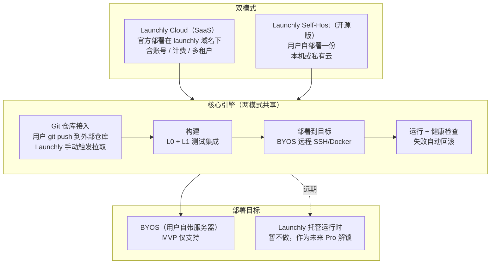
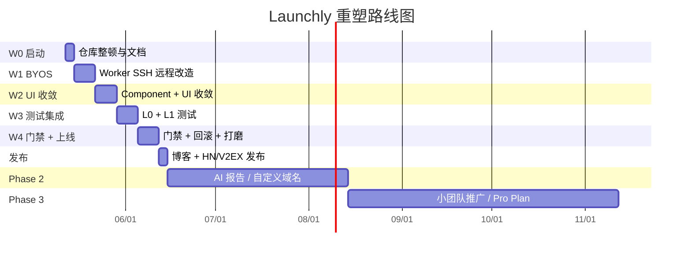

# 项目重塑计划（Launchly Rebirth Plan）

> 版本：v1.0  
> 制定日期：2026-05-12  
> 状态：已与项目负责人确认，待执行  
> 配套文档：[AI开发任务包.md](AI开发任务包.md)、[UI设计与规范.md](UI设计与规范.md)

---

## 0. 文档目的

本文档是 Launchly 的**产品方向重塑总纲**，把 2026-05 期间与产品负责人的方向讨论收敛成可执行的迁移计划。所有后续代码改动、文档调整、仓库操作都以本文件为准。

阅读对象：

- 项目负责人（决策者，也是主要使用者）
- AI 编程助手（执行者，需要明确边界）
- 未来的早期试用者或贡献者（理解项目转向脉络）

---

## 1. 重塑背景

### 1.1 偏离诊断

Launchly 在 2026-05-11 之前（第 1-13 周）按"自托管部署测试协作平台"的旧定位推进，已完成 12+ 个领域模块的基础骨架（部署、测试用例、Issue、Release 门禁、审计、通知、CLI install/backup/restore 等），但暴露出以下问题：

| 偏离信号 | 表现 |
| --- | --- |
| 范围爆炸 | 13 周完成 12+ 个领域模块，平均每模块仅 1 周，宽而浅 |
| 自我定位错位 | 自称"轻量"，但 Vue 3 + Spring Boot × 2 + Go CLI + Postgres + Compose 的三语言重栈和小团队"开箱即用"诉求不匹配 |
| 缺少锐利切入点 | 把测试管理（TestRail）、Issue 跟踪（Jira）、Release 门禁、审计、通知都做到与部署同级，每个子域都有强大竞品，没有差异化 |
| 形态封闭 | 只支持"单实例自托管"，封死 SaaS 路径与商业化空间 |
| 零真实用户验证 | 计划纯瀑布推进，第 14 周才开始端到端联调，没有 design partner 验证产品方向 |
| LICENSE 与商业模式冲突 | 当前 [LICENSE](LICENSE) 是 MIT，允许任何人 fork 商用，与"双模式 + SaaS 商业化"目标不兼容 |

### 1.2 真正的核心（与负责人原话对齐）

讨论中负责人原话：

> "本地和 SaaS 服务重点不同但**最终作用一样都是代码的托管和自动部署**。"

> "我自己其实是有点矛盾的⋯⋯**我希望收费能覆盖成本即可**，主打国内市场兼容全球市场。"

> "**新建项目提交代码管理测试方案就可以了**，自动化测试、部署、遇到问题快速回滚发布、日志等我都不需要操心。"

从这三句话提取出的产品真核：

1. **代码自动部署**是主线，不是协作
2. **商业目标是覆盖成本** + **拉 star** + **个人 / 小团队自用**，不是融资型 SaaS
3. **MVP 应该极简**，先解决一个人或一小团的部署 + 简单测试集成

---

## 2. 新产品定位（一句话）

> Launchly 是面向 **5-20 人小团队及个人开发者**的**轻量代码自动部署平台**，提供**双模式同源**交付：
> - **Launchly Cloud**（官方部署的 SaaS，账号注册即用）
> - **Launchly Self-Host**（开源版，用户自部署）
>
> 围绕"接入仓库 → 构建 → 部署 → 健康检查 → 回滚"主线做精，**测试集成、Issue、Release 门禁、审计、通知作为基础功能直接包含**（向阿里那套内部系统的小型版看齐），**AI 报告、第三方通知绑定、安全监控、托管运行时**作为付费增值。

---

## 3. 双模式交付架构



**核心引擎一份代码**。Cloud 和 Self-Host 之间通过编译时 / 运行时开关切换形态（详见第 6 节）。

---

## 4. 功能边界（三档版本对照）

| 功能 | Launchly Cloud Free | Launchly Cloud Pro | Launchly Self-Host（开源版） |
| --- | :---: | :---: | :---: |
| **核心引擎** | | | |
| 创建项目 | 1-2 个（具体上限待定） | 不限 | 不限 |
| 绑定 Git 仓库（GitHub / GitLab / 通用 PAT） | ✓ | ✓ | ✓ |
| 多 Component（一项目多服务，repo + root_dir） | ✓（UI 默认折叠） | ✓ | ✓ |
| 部署到 BYOS 服务器（SSH / Docker context） | ✓ | ✓ | ✓ |
| Launchly 托管运行时 | ✗ | 远期再开放 | ✗ |
| 构建 + 部署 + 健康检查 | ✓ | ✓ | ✓ |
| 部署日志实时流 | ✓ | ✓ | ✓ |
| 自动回滚（失败回到上一成功版本） | ✓ | ✓ | ✓ |
| 手动触发部署（用户点击发布） | ✓ | ✓ | ✓ |
| **环境与门禁** | | | |
| 多环境配置 | 固定 2 层 | 自定义 N 层 | 自定义 N 层 |
| 顺序门禁（L1：前一环境部署成功才能发下一环境） | ✓ | ✓ | ✓ |
| 进阶门禁（L2/L3/L4：测试通过 / Issue 关闭 / 人工审批） | ✗ | ✓ | ✓ |
| **测试** | | | |
| L0 测试（用户写 shell，看 exit code） | ✓ | ✓ | ✓ |
| L1 测试（解析 JUnit XML，可视化失败列表） | ✓ | ✓ | ✓ |
| L2 测试（内置 Playwright E2E runner） | ✗ | 远期 | 远期 |
| 测试用例库 / 公共与项目集 | ✓（基础） | ✓（高级） | ✓ |
| **协作** | | | |
| Issue 指派 + 复测闭环 | ✓ | ✓ | ✓ |
| Release 记录 | ✓ | ✓ | ✓ |
| 简单角色：Owner / Member / Viewer | ✓ | ✓ | ✓ |
| 项目级权限（人 × Component × 操作） | ✗ | ✓ | ✓ |
| **通知与审计** | | | |
| Webhook 通知 | ✓ | ✓ | ✓ |
| 第三方 App 通知绑定（飞书 / 钉钉 / 企业微信 / Slack / Discord） | ✗ | ✓ | ✗（开源版不内置，可自行实现） |
| 审计日志 | ✗ | ✓ | ✓ |
| **AI 增值** | | | |
| AI 日报 / 周报 / 月报 / 年报 | ✗ | ✓ | ✗ |
| AI 异常归因（部署失败 / 测试失败 智能分析） | ✗ | ✓ | ✗ |
| 项目安全监控（依赖漏洞 / 异常登录 / 可疑操作） | ✗ | ✓ | ✗ |
| **SaaS 控制面** | | | |
| 邮箱注册 + 邀请加入 | ✓ | ✓ | ✗（开源版用 Owner 初始化） |
| 计费门户 + 订阅管理 | – | ✓ | ✗ |
| **自托管运维** | | | |
| CLI install / up / down / status / logs / doctor | ✗ | ✗ | ✓ |
| 备份 / 恢复 | ✗ | ✗ | ✓ |

**关于"AI 报告内容"**：

负责人原话"运行情况、资源占用、安全情况、可疑操作等等，这都是我自己认为的你帮我增删改"。建议初版报告涵盖：

- **运行情况**：本周期部署次数、失败次数、平均部署耗时、最常变更的 Component、Top 3 慢任务、Top 3 失败原因
- **资源占用**：BYOS 目标的 CPU / 内存 / 磁盘趋势（如果用户授权采集）
- **安全情况**：依赖漏洞数（基于 osv.dev / GitHub Advisory）、过期凭据、未轮换的 Secret
- **可疑操作**：非常用 IP 登录、深夜大批量部署、未授权 Component 发布尝试
- **AI 摘要 + 建议**：上面的数据 + 一段自然语言总结 + 3 条可执行建议

每月生成一次 + 用户可主动触发。

---

## 5. 核心决策清单（已拍板，不再讨论）

| # | 决策点 | 决定 | 备注 |
| --- | --- | --- | --- |
| D-01 | 主线 | 代码自动部署，不是"协作平台" | 测试 / Issue / Release 是基础功能但不是主线 |
| D-02 | 商业模式 | side project that pays for itself | 不追求 ARR 增长，覆盖服务器成本 + 拉 star |
| D-03 | 双模式 | SaaS + 开源同源 | 一份代码两个产物 |
| D-04 | 部署目标 | MVP 全部走 BYOS（用户自带服务器） | 托管运行时延后到 Pro 远期 |
| D-05 | Git 托管 | **不做** Git 托管层 | 用户 git push 到 GitHub / GitLab，Launchly 用 PAT 拉取 |
| D-06 | 触发方式 | 用户在 UI 手动点"发布"，**不监听 webhook** | 不偷偷部署，符合严肃发布氛围 |
| D-07 | 角色权限 | 三档：Owner / Member / Viewer | 不按职位（前端/后端/测试）建模 |
| D-08 | 多 Component | 数据模型存在但 MVP UI 默认折叠 | 一项目默认建 1 个 `default` Component |
| D-09 | Component 抽象 | `(repo_binding, root_dir, build_cmd, start_cmd, port)` | 同一 repo 可被多个 Component 引用，按 root_dir 区分 |
| D-10 | 自动识别仓库结构 | 不做 | 用户手动配置，UI 给常见模板（Node + Express、Vue + nginx、Spring Boot Jar、Dockerfile） |
| D-11 | 测试档位 | MVP 做 L0 + L1 | L2/L3 远期作为付费功能 |
| D-12 | 环境与门禁 | 免费版 2 层 + L1 门禁 | 付费版 N 层 + L2/L3/L4 |
| D-13 | 项目类型 | MVP 主打 Web 后端 + Web 前端 + Dockerfile 兜底 | 移动 / 桌面 / 小程序不支持，只支持上传产物 |
| D-14 | LICENSE | **MIT → AGPL-3.0** | 防止他人 fork 你代码搭 SaaS 卖钱 |
| D-15 | 代码组织 | 模式 A：单仓库 + `cloud-only/` + `selfhost-only/` 目录 | 编译时 / 运行时 EDITION 开关 |
| D-16 | 仓库状态 | 维持公开，**不改私有** | 加 pivot banner，写一篇博客 |
| D-17 | 分支策略 | `main` 主开发，重塑工作走长 feature 分支 `refactor/dual-mode-deploy` | 稳定后合回 main |
| D-18 | 开发模式 | 个人 + AI vibecoding | 配套 [AI开发任务包.md](AI开发任务包.md) 控制边界 |
| D-19 | Phase 1 时间 | 4 周 | 目标：自己用 + 拉 star，不追求小团队商用 |
| D-20 | 市场 | 主打国内、兼容海外 | 计费先 Stripe，留出微信支付/支付宝预留位 |

---

## 6. 详细迁移工作清单

本节是把"从当前已开发状态" → "新方向"的所有操作展开。按**仓库操作 / 文档迁移 / 代码迁移 / 发布与营销**四类组织。

**总体节奏**：

```text
W0（启动期，本周内）
  → 仓库基础整顿（License、banner、分支、文档骨架）
  → 不动业务代码

W1（部署主线 BYOS 改造）
  → Worker 从本机 docker.sock 改为 SSH 远程执行
  → DeployTarget 模型 + 凭据加密

W2（UI 收敛 + 数据模型留口）
  → 测试/Issue/Release 入口降级（不删）
  → Component 概念落入数据模型（UI 默认隐藏）
  → 项目创建向导改造

W3（测试集成 L0 + L1）
  → 用户配 test command
  → 解析 JUnit XML，部署详情页可视化

W4（门禁 L1 + 自动回滚 + 体验打磨）
  → 顺序门禁 L1
  → 失败自动回滚
  → 部署日志实时流
  → 一篇博客 + 截图 + 发布到 HN / V2EX / r/selfhosted
```

### 6.1 仓库操作（W0 第 1-2 天完成）

| # | 操作 | 命令 / 说明 | 验收 |
| --- | --- | --- | --- |
| R-01 | 创建长 feature 分支 | `git checkout -b refactor/dual-mode-deploy` | 当前在新分支 |
| R-02 | 替换 LICENSE：MIT → AGPL-3.0 | 替换 [LICENSE](LICENSE) 文件全文，更新版权年 / 持有人 | `git diff LICENSE` 显示完整替换 |
| R-03 | 更新 [README.md](README.md) / [README.en.md](README.en.md) | 按"双模式 + 部署主线"重写，移除"自托管部署测试协作平台"表述（详见 6.2） | README 头部 strong 标语正确 |
| R-04 | 在 README 顶部加 pivot banner | 一段醒目提示：项目从 collab platform → deploy platform，链接到本文档 | 视觉上能立刻看到 |
| R-05 | 更新 GitHub 仓库 About 区描述 | 在 GitHub web 上手动改 description + topics | About 区显示新定位 |
| R-06 | 新建 [docs/product/direction-pivot-2026-05.md](docs/product/direction-pivot-2026-05.md) | 把本文件第 1-5 节的精华摘出来，作为单独的 pivot 决策记录 | 文件存在且与本计划一致 |
| R-07 | 修订 [docs/product/Launchly-design.md](docs/product/Launchly-design.md) | 第 1 章（项目概述）、第 2 章（用户与组织模型）按新方向重写 | 描述与新定位一致 |
| R-08 | 在 `docs/dev-tasks/plan.md` 顶部加历史归档说明 | 此文件被 `.gitignore` 忽略，无需公开改动，仅本地标注"旧路线，被项目重塑计划取代" | 本地能识别旧文件作废 |
| R-09 | 新建 [AI开发任务包.md](AI开发任务包.md) | 提供给 AI 的任务清单 + 长期规范 | 文件存在，AI 可直接读取使用 |
| R-10 | 新建 [UI设计与规范.md](UI设计与规范.md) | 多页面初版设计稿 + UI 规范 | 文件存在，前端开发可对照实施 |
| R-11 | 提交 W0 整顿成果 | `git add -A && git commit -m "docs: pivot from collab platform to lightweight auto-deployment platform"` | 一次清晰可读的 commit |
| R-12 | 推送 feature 分支到 origin | `git push -u origin refactor/dual-mode-deploy` | GitHub 上能看到分支 |

> **关于 R-04 banner 文案**（建议直接复用）：
>
> ```markdown
> > 🔄 **2026-05 项目方向重塑**：Launchly 已从「自托管部署测试协作平台」收敛为「**双模式同源的轻量代码自动部署平台**」。详见 [项目重塑计划.md](项目重塑计划.md)。当前主分支仍为旧版本骨架，新方向在 `refactor/dual-mode-deploy` 分支下开发。
> ```

### 6.2 文档迁移细则（W0 第 2-3 天）

#### 6.2.1 [README.md](README.md) 重写要点

替换以下章节（**保留**目录结构、快速开始、开发指南、许可证之外的章节也可适度修订）：

| 章节 | 旧内容 | 新内容 |
| --- | --- | --- |
| 标语 | "自托管部署测试协作平台" | "轻量代码自动部署平台 · 双模式交付" |
| 描述段 | "Git 项目接入、测试环境部署⋯⋯放到一个轻量系统里管理" | "面向 5-20 人小团队和个人开发者。核心：把 Git 项目自动构建并部署到目标环境。两种交付方式：Launchly Cloud / Launchly Self-Host" |
| 为什么是 Launchly | 描述部署+测试+发布的链路 | 收敛为"从代码到运行环境的低成本、可重复、可追踪通路"+ 双模式表格 |
| 项目状态 | 第 1-13 周已完成 / 第 14 周联调 | pre-alpha + 方向修正中 + 引用本计划 |
| 功能规划 | 10 条混杂功能 | 分四块：核心引擎 / 协作（基础） / SaaS 控制面 / Self-Host 运维 / 付费增值 |
| 项目进展 | 表格按周计数 | 表格按"已完成 / 改造中 / 未开始" |
| 开源协议 | "尚未确定" | AGPL-3.0 |

#### 6.2.2 [README.en.md](README.en.md) 重写要点

与中文版完全对应，标语：`Lightweight code auto-deployment platform · Dual delivery`。

#### 6.2.3 [docs/product/Launchly-design.md](docs/product/Launchly-design.md) 修订要点

- 第 1 章「项目概述」：引入 Organization、双模式、Plan、DeployTarget 概念
- 第 2 章「用户与组织模型」：把 Workspace 改为 Organization；角色精简为 Owner / Member / Viewer + Component 级权限（远期）
- 第 3 章「核心业务流程」：把"测试 → Issue → Release → 门禁"标注为"基础功能"，但 mermaid 图主线收敛到部署
- 新增章节「双模式与 Edition 开关」：cloud-only vs selfhost-only 模块边界
- 新增章节「DeployTarget 抽象」：BYOS SSH / Docker context 数据模型
- **不删除**原有详细流程描述，作为协作能力的设计参考保留

#### 6.2.4 新建 [docs/product/direction-pivot-2026-05.md](docs/product/direction-pivot-2026-05.md)

简短版本（500-1000 字）的 pivot 决策记录，结构：

1. 背景：旧定位与偏离信号
2. 新定位（一句话）
3. 五个核心决策（D-01 ~ D-05 摘录）
4. 新旧能力对照表（参考 Q1-Q6 讨论结果）
5. 影响：哪些代码继续 / 哪些降级 / 哪些新增
6. 时间表：4 周 + 后续

### 6.3 代码迁移（W1 ~ W4，每周一个主题）

每一项的**详细 prompt**见 [AI开发任务包.md](AI开发任务包.md)。本节只列任务编号、文件影响范围、依赖关系。

#### W1 - BYOS Worker 改造（核心，工程量最大）

| Task | 标题 | 影响范围 | 依赖 |
| --- | --- | --- | --- |
| T-W1-01 | 新建 `DeployTarget` 实体（type / host / port / user / auth_method / encrypted_credential） | `services/api/src/main/java/com/launchly/target/`（新建包） + Flyway 迁移 | – |
| T-W1-02 | `DeployTarget` CRUD API + 凭据加密 / 脱敏 | `target/controller`、`target/service`、`common/crypto` | T-W1-01 |
| T-W1-03 | 凭据连通性测试接口（SSH 探活 / Docker 连接探活） | `target/service` | T-W1-02 |
| T-W1-04 | 把 `Deployment` 关联 `DeployTarget`（外键）| `services/api/src/main/java/com/launchly/deployment/` Flyway 迁移 | T-W1-01 |
| T-W1-05 | Worker `Runner` 抽象层：`LocalDockerRunner` + 新增 `RemoteSshRunner` | `services/worker/src/main/java/com/launchly/worker/runner/` | T-W1-04 |
| T-W1-06 | 移除 `docker-compose.yml` 第 53 行 `/var/run/docker.sock` 挂载 | [deploy/compose/docker-compose.yml](deploy/compose/docker-compose.yml) | T-W1-05 完成后 |
| T-W1-07 | Worker 通过 SSH 在远程目标上执行 `git clone` + `docker build` + `docker run` 完整链路 | `worker/runner/RemoteSshRunner` | T-W1-05 |
| T-W1-08 | 远程执行日志回流（stdout/stderr 流式回写到 deployment_logs 表） | `worker/runner` + `deployment` 模块 | T-W1-07 |
| T-W1-09 | Web 端新增"部署目标管理"页面（按 [UI设计与规范.md](UI设计与规范.md) 3.7 节实现） | `apps/web/src/pages/DeployTargetListPage.vue`（新建）+ router | T-W1-02 |

**Worker 隔离修复**：T-W1-06 是安全红线。SaaS 版本绝对不允许挂宿主机 docker.sock；Self-Host 用户的本机部署也应通过 SSH 到 `localhost` 实现，而不是挂 socket。

#### W2 - UI 收敛 + Component 数据模型留口

| Task | 标题 | 影响范围 | 依赖 |
| --- | --- | --- | --- |
| T-W2-01 | 新建 `Component` 实体（project_id / name / repo_binding_id / root_dir / build_cmd / start_cmd / port） + Flyway 迁移 | `services/api/src/main/java/com/launchly/component/`（新建包） | – |
| T-W2-02 | 把 `Repository` 绑定从 `Project` 下移到 `Component`，Flyway 迁移把现有数据每个 project 补一个 `default` component | Flyway 迁移脚本 + JPA 实体调整 | T-W2-01 |
| T-W2-03 | `Component` CRUD API（list/create/update/delete） | `component/controller` | T-W2-01 |
| T-W2-04 | 部署接口改为 `POST /projects/:id/components/:cid/deploy`，旧 `POST /projects/:id/deploy` 保留兼容（默认转发到 `default` component） | `deployment/controller` | T-W2-03 |
| T-W2-05 | Web 端：项目详情页改为"Component 折叠卡片"，单 component 时折叠隐藏 component 层；多 component 时展开 | `apps/web/src/pages/ProjectDetailPage.vue` | T-W2-03 |
| T-W2-06 | Web 端：项目创建向导新增"添加 Component"步骤（默认 1 个，可加） | `apps/web/src/pages/ProjectCreatePage.vue` | T-W2-03 |
| T-W2-07 | 顶部导航和 Dashboard 入口收敛：主推部署 / 部署目标 / 项目；测试 / Issue / Release / 审计 / 通知 入口下沉到二级菜单 | `apps/web/src/pages/AppLayout.vue`、`DashboardPage.vue`、`router/index.ts` | – |
| T-W2-08 | 项目列表 / 项目详情按 [UI设计与规范.md](UI设计与规范.md) 重新布局 | `apps/web/src/pages/Project*.vue` | T-W2-05 |

#### W3 - 测试集成 L0 + L1

| Task | 标题 | 影响范围 | 依赖 |
| --- | --- | --- | --- |
| T-W3-01 | Component 增加 `test_command` 和 `test_report_path` 字段 | Flyway 迁移 + 实体 | T-W2-01 |
| T-W3-02 | Worker 在部署流水线增加 `test` 阶段：构建后跑 `test_command`，记录 exit code | `worker/pipeline` | T-W1-07 |
| T-W3-03 | 从 `test_report_path`（默认 `./test-results/*.xml`）抓取 JUnit XML，回传到 API | `worker/pipeline/TestReportCollector` | T-W3-02 |
| T-W3-04 | API 解析 JUnit XML，存 `test_run_case` 表（复用现有 `testcase` 模块的 schema） | `services/api/src/main/java/com/launchly/testcase/` | T-W3-03 |
| T-W3-05 | Web 端：部署详情页增加"测试结果"标签页（用例总数、通过、失败、跳过、失败详情） | `apps/web/src/pages/DeploymentDetailPage.vue` | T-W3-04 |
| T-W3-06 | 测试失败时可一键转 Issue（复用现有 `issue` 模块） | `apps/web/src/pages/DeploymentDetailPage.vue` | T-W3-05 |

#### W4 - 门禁 L1 + 自动回滚 + 体验打磨

| Task | 标题 | 影响范围 | 依赖 |
| --- | --- | --- | --- |
| T-W4-01 | `Environment` 增加 `order` 字段，按 order 排序成顺序链 | Flyway 迁移 + 实体 | – |
| T-W4-02 | 部署接口校验：发布到 env[n] 必须 env[n-1] 至少有一次成功部署 | `deployment/service/DeploymentGate` | T-W4-01 |
| T-W4-03 | 部署失败时记录 `last_successful_deployment_id`；UI 提供"回滚到上一成功版本"按钮 | `deployment/service/RollbackService` + UI | – |
| T-W4-04 | 部署日志实时流（SSE 或 WebSocket，从 Worker → API → 前端） | `worker` + `api/deployment` + `apps/web/src/pages/DeploymentDetailPage.vue` | – |
| T-W4-05 | Web 端：Dashboard 改造为"最近部署"+ "项目概览"+ "失败 Issue 待处理" | `apps/web/src/pages/DashboardPage.vue` | – |
| T-W4-06 | Web 端：登录 / 注册 / 部署目标 / 项目详情 / 部署详情 全部按 [UI设计与规范.md](UI设计与规范.md) 验收 | 多个 vue 文件 | – |
| T-W4-07 | 性能 / 错误处理 / 空态 / loading 状态全面检查 | 多个 vue 文件 | – |

### 6.4 发布与营销（W4 末 + W5）

| # | 操作 | 说明 |
| --- | --- | --- |
| M-01 | 把 `refactor/dual-mode-deploy` 分支合并回 `main` | `git merge --no-ff` 保留分支历史 |
| M-02 | 打 tag `v0.2.0-pivot` | 区分旧骨架（v0.1.x）和新方向 MVP |
| M-03 | 在 GitHub Releases 写一篇 release notes | 内容：从旧到新的转变、可用功能、已知限制 |
| M-04 | 用 Launchly 自己部署一个示例项目 | 例如部署一个静态站点（你的个人项目集网站） |
| M-05 | 写一篇博客 / 公众号 / 掘金 / X / dev.to | 主题"Why I pivoted Launchly: from a kitchen sink to a focused tool" |
| M-06 | 提交到 Hacker News / r/selfhosted / r/devops / V2EX / GitHub Trending 标签 | 第一波获取 star |
| M-07 | 在你的项目集网站上挂 Launchly | 部署脚本教程 + release 版本下载 |

---

## 7. Phase 路线图



- **Phase 1（W0-W4，约 4 周）**：你自己用 + 拉 star
- **Phase 2（约 2 个月）**：根据 star/Issue 反应决定加什么：AI 报告 / 自定义域名 / Cron / Preview / 进阶门禁
- **Phase 3（约 3 个月）**：推向 5-20 人小团队，引入 Pro Plan（Stripe + 多角色 + AI 报告 + 安全监控 + 三方通知）
- **远期（不在本计划内）**：Launchly 托管运行时（如有 Pro 用户基数且合规风险可控）

---

## 8. 风险与缓解

| 风险 | 触发条件 | 缓解措施 |
| --- | --- | --- |
| Phase 1 拖到 6-8 周 | W1 SSH 改造遇到隔离 / 凭据加密 / 网络问题 | 优先做"localhost SSH"路径（同机），跨机部署延后 1 周 |
| 用户拒绝改 License | 担心 AGPL-3.0 不被某些用户接受 | 双 License：开源用户走 AGPL，商业客户可购买例外许可（参考 MariaDB / Sentry） |
| 旧代码（测试/Issue/Release/审计/通知）改造中破坏现有功能 | UI 收敛不当 | 测试入口降级到二级菜单，**不删代码**，保留路由路径只是不主推 |
| 个人开发者市场不接受 BYOS | 嫌"得有服务器" | 在 README / 博客里强调"99 元/年的服务器就够用"，并给一键购买阿里云 / 腾讯云轻量服务器链接 |
| AI vibecoding 跑偏 | AI 不读规范、扩大范围 | 配套 [AI开发任务包.md](AI开发任务包.md)，每个任务前必读"通用前置提示词" |
| 已写 13 周代码无人验证导致大量 bug 浮现 | W1-W4 联调阶段 | 修复优先级：影响部署主线 > 影响测试 > 影响协作 |
| GitHub 仓库改名 / 改组织 | 后悔现在的仓库地址 | 保持 `tppc-linksc/Launchly` 不变，等 v1.0 前需要改再改 |

---

## 9. 验收（4 周后达成即视为 Phase 1 完成）

- [ ] 仓库 LICENSE 已改为 AGPL-3.0
- [ ] README 顶部有 pivot banner，描述新方向
- [ ] `refactor/dual-mode-deploy` 分支已合回 main
- [ ] `v0.2.0-pivot` tag 已发布
- [ ] 你能在 Launchly 里创建一个项目，绑定到一个 BYOS 目标（你自己的服务器），手动点击发布，看到实时构建/部署日志，访问到部署后的服务
- [ ] 部署详情页能看到 JUnit XML 解析后的测试结果
- [ ] 顺序门禁 L1 生效：未通过第一个环境就发不到第二个
- [ ] 部署失败能一键回滚到上一个成功版本
- [ ] 至少 1 篇博客 / 1 次 HN/V2EX 发帖 / 你的项目集网站挂了 Launchly 入口
- [ ] GitHub star ≥ 30（不强制，作为参考指标）

---

## 10. 文档自更新约束

- 本文件版本号变更 ≡ 核心决策清单（第 5 节）任何一项被修改
- 修改决策时必须在第 5 节加一行 changelog（日期 + 决策编号 + 修改原因）
- AI 在执行任务时如果发现本文件与 [AI开发任务包.md](AI开发任务包.md) 冲突，**以本文件为准**

---

**附：决策变更日志**

| 日期 | 决策编号 | 变更 | 原因 |
| --- | --- | --- | --- |
| 2026-05-12 | – | 初版定稿 | 与负责人 Q1-Q7 讨论收敛 |
